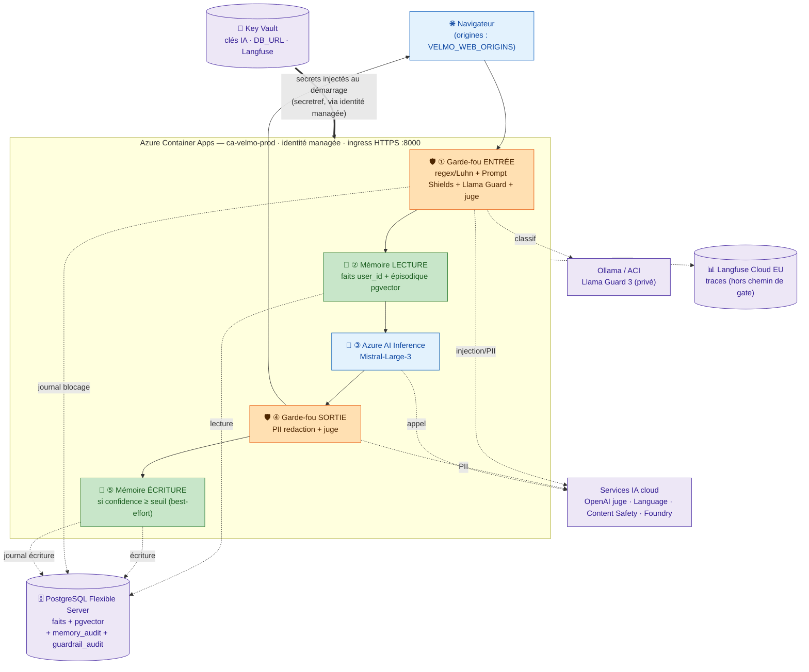

# Exercice — Héberger Velmo 2.0 sur Azure (hébergement, secrets, schéma cible)

> Réponse aux 3 objectifs, appuyée sur l'architecture réelle de Velmo 2.0. Le *pourquoi*
> détaillé vit dans `docs/reference/conceptions/conception_chantier3_evaluation_mlops.md` §Cible de
> déploiement ; le *comment* (commandes `az`) dans `docs/tutorials/tuto_azure_deploiement.md` §C/§D/§F ; le
> schéma canonique dans `docs/reference/schemas/05-deploiement-azure.md`.

---

## 1. Choisir les services Azure pour héberger l'agent et sa mémoire

### 1.a — Héberger l'agent : App Service vs conteneur

L'app est **déjà packagée en image** (`Dockerfile` multi-stage, non-root, `CMD uvicorn`,
`GET /health`, écoute `0.0.0.0:8000`). Le choix se joue donc entre deux façons de faire tourner
ce conteneur.

| Critère | App Service (Web App for Containers) | **Azure Container Apps (retenu)** |
| --- | --- | --- |
| **Facilité** | ✅✅ PaaS le plus simple, un seul concept | ✅ un cran de plus (environnement, révisions) |
| **Coût** | ⚠️ plan facturé en continu, même à vide (~13 €/mois) | ✅✅ **scale-to-zero** → ≈ 0 quand personne ne parle |
| **Adéquation** | ✅ mono-conteneur | ✅✅ natif conteneur, cohérent avec Ollama déjà sur ACI |

**Choix justifié : Azure Container Apps.**

- **Coût** — décisif : projet à faible charge / démo, le scale-to-zero facture ≈ 0 à l'arrêt,
  là où App Service facture son plan en continu.
- **Adéquation** — l'artefact conteneur existe déjà ; ACA le déploie tel quel, et l'identité
  managée native lit Key Vault sans clé en clair.
- **Compromis assumé** — *cold start* au 1er appel après inactivité (`min-replicas 0`),
  relevable à `1` si la latence de démarrage gêne. Le juge garde-fous bloquant reste toujours
  chaud (Azure OpenAI) → le chemin critique n'est pas concerné.
- **Repli légitime** : App Service si l'on privilégie la facilité brute à l'économie — les deux
  se défendent, c'est la justification qui compte.

### 1.b — Stockage persistant de la mémoire long terme (R2, R3)

La mémoire de Velmo est un **seul Postgres** (source unique `DB_URL`) : faits durables
relationnels **+** mémoire épisodique `pgvector` dans la **même base**.

**Choix : Azure Database for PostgreSQL Flexible Server** (service managé), pas un conteneur
Postgres jetable. Tier **Burstable `Standard_B1ms`** (1 vCPU / 2 Go) — accumule des crédits CPU
à l'idle, les dépense sur les pics : pile le profil démo à faible charge, cohérent avec le
scale-to-zero de l'app. Monter en `General Purpose` (`Standard_D2ds_v5`) seulement si une vraie
charge prod constante l'exige.

- **R2 — persistance multi-session** : service managé = durabilité, backups automatiques, PITR
  (35 j dans le tuto). Renforcé côté code par `require_durable_store` (`config.py`) qui **fait
  échouer le démarrage en production** si le store durable est injoignable — jamais de repli
  SQLite silencieux.
- **R3 — isolation par utilisateur** : isolation **logique par `user_id`** (colonne + requêtes
  filtrées, déjà dans le code), option de renfort Row-Level Security Postgres. Un seul serveur,
  isolation applicative — pas un Postgres par utilisateur.

> `pgvector` s'active en extension sur le Flexible Server (`azure.extensions=VECTOR` puis
> `CREATE EXTENSION vector`). La KB FAQ (hors mémoire épisodique) vit aussi en `pgvector` —
> plus aucun service Chroma à déployer.

---

## 2. Gestion des secrets et de la configuration

**Principe de tri :** *secret* (sa fuite compromet un accès) → **Key Vault** ; *paramètre*
(valeur de réglage) → **variable d'application**. Rien des deux en clair dans Git.

### 2.a — Liste des secrets à externaliser (→ Azure Key Vault)

| Secret | Variable(s) |
| --- | --- |
| Clé + endpoint agent LLM | `AZURE_AI_INFERENCE_API_KEY` / `AZURE_AI_INFERENCE_ENDPOINT` |
| Clé + endpoint juge garde-fous | `AZURE_OPENAI_GUARD_API_KEY` / `AZURE_OPENAI_GUARD_ENDPOINT` |
| Clé + endpoint extracteur / juge qualité (Foundry) | `ANTHROPIC_API_KEY` / `ANTHROPIC_FOUNDRY_ENDPOINT` |
| Clé + endpoint PII redaction | `AZURE_LANGUAGE_KEY` / `AZURE_LANGUAGE_ENDPOINT` |
| Clé + endpoint Prompt Shields | `AZURE_CONTENT_SAFETY_KEY` / `AZURE_CONTENT_SAFETY_ENDPOINT` |
| **Chaîne de connexion mémoire** (contient le mot de passe) | `DB_URL` |
| Clé secrète observabilité | `LANGFUSE_SECRET_KEY` |

> Les **endpoints** sont des URL publiques (pas des secrets) : ils peuvent rester des variables
> d'app ordinaires. Ce sont les **clés** et la **chaîne de connexion** qui exigent le coffre.

### 2.b — Paramètres non-secrets (→ variables d'application, pas Key Vault)

Seuils garde-fous & qualité (`MEMORY_CONFIDENCE_THRESHOLD`, `MEMORY_TOKEN_BUDGET`,
`GATE_MIN_SCORE`, `GATE_LATENCY_P95_CEILING_MS`, `GATE_COST_PER_CONV_CEILING`,
`LLAMA_GUARD_LATENCY_THRESHOLD_MS`), noms de modèles, `ENVIRONMENT`, `VELMO_WEB_ORIGINS`,
`OLLAMA_URL`, `TOKEN_PRICING`.

### 2.c — Où et comment (côté Azure)

1. L'app (ACA) porte une **identité managée** (`--system-assigned`).
2. Cette identité reçoit le rôle **Key Vault Secrets User** sur le vault (RBAC, pas
   access-policy) — tuto §D3.
3. La config ACA **référence** chaque secret (`az containerapp secret set … keyvaultref:…` +
   `--set-env-vars VAR=secretref:…`), résolu par l'identité **au démarrage**. La clé
   n'apparaît **jamais** en clair — ni dans la config, ni dans l'image, ni dans Git.
4. Garanties déjà en place dans le repo : `.env` **gitignored**, `.env.example` ne contient que
   des placeholders `<resource>`, `.dockerignore` exclut `.env` du contexte de build (audit
   D6-05), et `validate_startup` **rejette au démarrage** tout placeholder non résolu ou couple
   endpoint/clé à moitié posé.

> ✅ **Critère « liste complète »** : les 7 secrets ci-dessus (2.a). ✅ **Critère « exclut toute
> présence dans le code source »** : référence Key Vault + identité managée ; `.env` gitignored,
> exclu de l'image, placeholders rejetés au démarrage.

---

## 3. Schéma de déploiement cible

Schéma canonique : [`docs/reference/schemas/05-deploiement-azure.md`](../reference/schemas/05-deploiement-azure.md).
Reproduit ci-dessous — la chaîne
**garde-fou entrée → mémoire lecture → Azure OpenAI → garde-fou sortie → mémoire écriture** est
préservée à l'intérieur de l'hôte.

**Où passent les secrets** : Key Vault → hôte (flèche épaisse), résolus par l'identité managée
au démarrage de la révision ; endpoints en clair, clés + `DB_URL` en `secretref`.

**Où sont lus/écrits les journaux** :
- décisions garde-fous → `guardrail_audit` (Postgres, log sécurité conservé même après oubli) ;
- écritures mémoire → `memory_audit` (Postgres, soumis au droit à l'oubli R5) ;
- traces d'observabilité → Langfuse Cloud EU (hors chemin de gate, pointeur seulement) ;
- logs d'infra (stdout conteneurs) → Log Analytics de l'environnement ACA.
