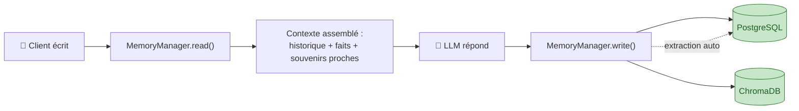
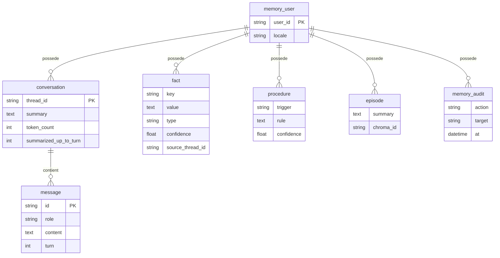
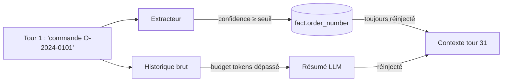
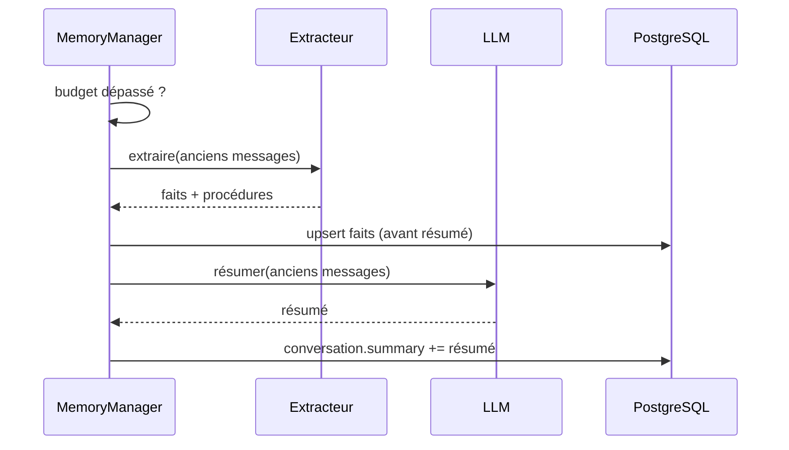
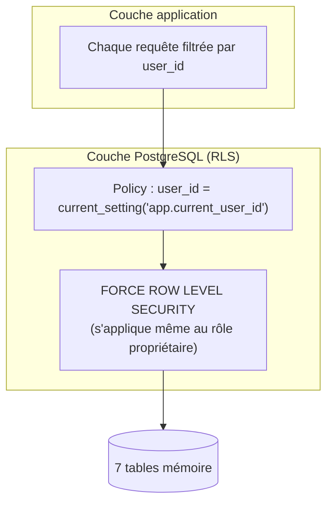
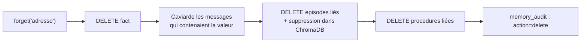

# Chantier 1 — Mémoire : ce qu'on a codé

> Support oral. Un problème par section, un schéma, la preuve que ça marche.

> ⚠️ **Statut : as-built (implémentation actuelle), pas la référence de conception.**
> Ce document décrit le code **tel qu'il tourne aujourd'hui** (orchestration mémoire
> hand-rolled en SQLAlchemy, 7 tables dont `conversation`/`message`). La **référence
> d'architecture cible** est [`docs/reference/conceptions/conception_chantier1_memoire.md`](../reference/conceptions/conception_chantier1_memoire.md)
> (orchestration **LangGraph** + checkpointer `PostgresSaver`, durcissements R5, calibration,
> TTL épisodes…). Le code sera **réaligné sur la conception** ; ce support sera régénéré à ce
> moment-là. En cas de divergence, **la conception fait foi**.

---

## 1. Vue d'ensemble : 3 mémoires, 1 seul point d'entrée

Tout passe par une seule classe : `MemoryManager`. Deux méthodes suffisent à l'agent : `read()` avant de répondre, `write()` après.



**Le point clé** : l'agent ne décide jamais lui-même quoi retenir. Un composant séparé — l'**extracteur** — analyse chaque échange après coup et décide, avec un score de confiance, ce qui mérite d'être stocké durablement.

---

## 2. Le modèle de données (7 tables PostgreSQL)



3 natures de souvenir long terme, 3 usages différents :

| Table | Le "quoi" | Exemple |
|---|---|---|
| `fact` | ce qui est **vrai** sur le client | `shoe_size = L`, `segment = revendeur` |
| `procedure` | comment se **comporter** avec lui | "proposer un avoir plutôt qu'un remboursement" |
| `episode` | ce qui s'est **passé** | "litige contrefaçon signalé le 12/06" |

`memory_audit` journalise chaque écriture/suppression → sert de preuve pour R6.

---

## 3. R1 — Tenir 30+ tours sans rien perdre

**Piège évité** : si on résume bêtement après 30 tours, l'info du tour 1 peut disparaître dans le résumé.

**Solution codée** : le fait critique est **extrait et rangé à part avant** que le texte brut ne soit compressé. Le résumé peut perdre des détails, jamais les faits.



✅ Preuve : `test_r1_info_tour1_au_tour30` — fait relu tel quel après 30 tours.

---

## 4. R4 — Tenir le budget de tokens (compression)

Déclenchée dans `_maybe_compress()`, dès que `token_count > token_budget` :

1. **Extraction préalable** sur le bloc à résumer (les faits en sortent avant).
2. **Résumé LLM** du bloc (remplace le texte brut).
3. Le résumé s'ajoute à `conversation.summary`, l'ancien texte n'est plus rechargé.



✅ Preuve : `test_r4_compression_sans_perte` — résumé bien produit, **et** le fait critique survit dans `ctx.facts`.

---

## 5. R2 — Se souvenir d'une session à l'autre

Rien de magique : les faits/procédures sont en base, pas en mémoire process. Un **nouveau** `MemoryManager` (= nouvelle session) qui pointe sur la même base retrouve tout.

✅ Preuve : `test_r2_persistence_inter_session` — session 1 écrit avec un extracteur, session 2 (extracteur différent) relit faits + procédures identiques.

---

## 6. R3 — Isolation stricte entre clients

Deux couches, pas une seule :



- **App** : `_bind_user()` fixe le GUC `app.current_user_id` en tête de chaque session DB.
- **DB** : la policy Postgres refait le contrôle même si l'app se trompe → défense en profondeur, pas juste "on fait confiance au code".

✅ Preuve : `test_r3_isolation_user` — le contexte de B ne contient **aucune** clé de A.

---

## 7. R5 — Droit à l'oubli (RGPD)

`forget(user_id, target)` = **suppression physique**, pas un flag :



✅ Preuve : `test_r5_droit_oubli` — info absente du rendu **après** l'appel, alors qu'elle y était juste avant.

---

## 8. R6 — Traçabilité

`inspect(user_id)` retourne tout ce qui est retenu, avec l'origine :

```json
{
  "facts": [
    {"key": "order_number", "value": "O-2024-0101",
     "source_thread_id": "...", "created_at": "2026-07-10T..."}
  ],
  "procedures": [...]
}
```

✅ Preuve : `test_r6_inspection` — `source_thread_id` non nul, `created_at` en ISO 8601.

---

## 9. Deux bases, deux rôles

| | PostgreSQL | ChromaDB |
|---|---|---|
| Rôle | **le classeur** — vérité exacte | **le moteur de recherche** — similarité sémantique |
| Contient | faits, procédures, messages, audit | résumés d'épisodes (embeddings) |
| Pourquoi | suppression propre et garantie (R5) | retrouver "un litige qui ressemble à celui-ci" sans mot-clé exact |

`get_episodic_backend()` : Chroma réel si dispo, sinon repli **local** (recherche par tokens) — pas de dépendance dure en dev/test.

---

## 10. Bilan qualité

| Contrôle | Résultat |
|---|---|
| Tests d'acceptance R1–R6 | **10/10 passent** |
| mypy `--strict` sur `memory/` | 0 erreur |
| ruff | 0 issue |
| RLS Postgres | activée + `FORCE` sur les 7 tables |

