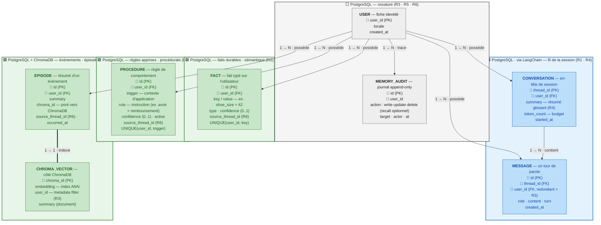

# Chantier 1 — Mémoire

## Stack

| Brique         | Rôle dans la mémoire                                                                                                                                                                                                |
| -------------- | ------------------------------------------------------------------------------------------------------------------------------------------------------------------------------------------------------------------- |
| **LangChain**  | Orchestration + abstractions mémoire : historique de conversation (`RunnableWithMessageHistory`, `PostgresChatMessageHistory`), résumé glissant (`ConversationSummaryBufferMemory`), embeddings, `Chroma` retriever |
| **PostgreSQL** | Stockage relationnel cloisonné : messages court terme, faits sémantiques, règles procédurales, métadonnées d'épisodes, journal d'audit RGPD                                                                        |
| **ChromaDB**   | Index vectoriel de la mémoire épisodique : embeddings + recherche par similarité, filtrés par `user_id`                                                                                                             |

---

## Exigences à couvrir

| Réf.   | Exigence                                                                                                       | Nature                |
| ------ | -------------------------------------------------------------------------------------------------------------- | --------------------- |
| **R1** | Tenir 30+ tours sans perdre une info donnée au 1er tour                                                        | Court terme           |
| **R2** | Se souvenir d'une session à l'autre (jours plus tard) des faits/préférences durables                           | Long terme            |
| **R3** | Isolation stricte : la mémoire d'un utilisateur jamais accessible à un autre                                   | Transverse            |
| **R4** | Tenir la fenêtre de contexte : au-delà d'un budget de tokens, résumer/sélectionner sans perdre l'info critique | Court terme + travail |
| **R5** | Droit à l'oubli (RGPD) : suppression effective et vérifiable                                                   | Long terme            |
| **R6** | Traçabilité : inspecter ce que l'agent a retenu                                                                | Transverse            |

---

## Les trois types de mémoire et leur rôle

| Type                           | Durée de vie              | Contenu                                                               | Support (stack)                                                           |
| ------------------------------ | ------------------------- | --------------------------------------------------------------------- | ------------------------------------------------------------------------- |
| **Travail (working)**          | Le tour courant           | État transitoire : résumé glissant, souvenirs rappelés, budget tokens | En mémoire, dans le state LangChain — non persisté                        |
| **Court terme (conversation)** | Une session/thread        | Fil brut des tours (user/assistant/tool)                              | **PostgreSQL** via `PostgresChatMessageHistory` (LangChain)               |
| **Long terme (persistant)**    | Illimitée (jusqu'à oubli) | Faits durables + règles procédurales + épisodes marquants             | **PostgreSQL** (faits + règles + métadonnées) + **ChromaDB** (embeddings épisodes) |

<!-- **Lecture directe des exigences :**

- **R1** → court terme : tant que le thread tient dans le budget, l'info du tour 1 est littéralement présente. Au dépassement (30 tours), la mémoire de travail (résumé glissant + rappel long terme) prend le relais → **R4**.
- **R2** → long terme sémantique : préférences (« tutoie-moi », « client pro », n° de contrat) extraites en fin de session, rechargées à la session suivante via `user_id`.
- **R3** → propriété transverse : filtrage `user_id` sur PostgreSQL **et** ChromaDB (§5).
- **R4** → court terme + travail : résumé glissant LangChain + top-k recall Chroma (§4).
- **R5** → long terme : `DELETE` PostgreSQL + `collection.delete()` ChromaDB + audit (§5).
- **R6** → inspection listant tout le long terme d'un `user_id` (§5). -->

---

## Modèle de données de la mémoire

Trois natures de mémoire long terme :

- **Sémantique** — _faits durables_ (le « quoi ») : pointure, statut pro, n° de contrat, équipes suivies. Modélisés en **faits typés** dans PostgreSQL (`fact`), requêtés en direct (déterministe), tous réinjectés dans le prompt (petit volume).
- **Épisodique** — _ce qui s'est passé_ (le « quand/comment ») : « le 12/06 a signalé un défaut d'authenticité sur #A1832, escaladé ». Résumé stocké dans PostgreSQL (`episode`) + embedding dans **ChromaDB**, rappelé par similarité (top-k) au tour courant.
- **Procédurale** — _comment agir avec ce client_ (le « comment ») : une règle de comportement apprise, pas un fait sur lui ni un événement passé — ex. « proposer un avoir plutôt qu'un remboursement », « toujours reformuler les tailles en cm ». Modélisée en **règle typée** dans PostgreSQL (`procedure`), injectée comme instruction dans le prompt système avant que l'agent ne réponde (elle change le *comment répondre*, pas le contenu factuel réinjecté).

On retient **faits/règles typés + embeddings + métadonnées**, pas un simple clé-valeur nu : `type`, `confidence`, `source_thread_id` rendent R5/R6 réalisables.

> **Pourquoi séparer `fact` et `procedure` plutôt que tout mettre dans `fact` ?** Un `FACT` répond à *« qu'est-ce qui est vrai sur ce client ? »* (donnée réinjectée telle quelle dans le contexte). Une `PROCEDURE` répond à *« comment dois-je me comporter avec ce client ? »* (instruction injectée dans le système, qui pilote le comportement de l'agent). Mélanger les deux rendrait le prompt système ambigu — un fait n'est pas une consigne de comportement, et une règle n'a pas de `value` figée à afficher.



> **Légende des cartes :** la **couleur** encode le **type de mémoire** — 🟦 bleu = **court terme** · 🟩 vert = **long terme** (sémantique + procédurale + épisodique) · ⬜ gris = **transverse** (identité + audit). La mémoire de **travail** n'apparaît pas : elle n'est jamais stockée (voir plus bas).

### Comment lire ce schéma

Lecture des flèches :

- `USER → CONVERSATION / MESSAGE / FACT / PROCEDURE / EPISODE` (**possède**, 1 → N) → un **utilisateur** possède 0 à N de chacun ; chaque enfant appartient à un seul utilisateur (colonne `user_id`).
- `USER → MEMORY_AUDIT` (**trace**, 1 → N) → chaque action mémoire laisse une ligne de journal.
- `CONVERSATION → MESSAGE` (**contient**, 1 → N) → une conversation est faite du fil de ses messages.
- `EPISODE = CHROMA_VECTOR` (**indexe**, 1 → 1, trait double) → un épisode (texte, PostgreSQL) ↔ exactement un vecteur (ChromaDB), reliés par `chroma_id`.

### Explication table par table (rattachée au type de mémoire)

Rappel des trois types : **court terme** (le fil de la conversation en cours), **long terme** (ce qui survit entre sessions), **travail** (calculé à la volée, non stocké — donc absent du schéma de données). Le schéma ci-dessus ne contient donc que du court terme, du long terme, et deux tables transverses (identité + audit).

#### 🟦 Court terme — « ce qui se dit maintenant » (R1, R4)

Objectif : garder le **fil brut** de la session en cours pour ne rien perdre pendant la conversation. Persisté en PostgreSQL pour survivre à un redémarrage, mais rattaché à un seul `thread_id` (une session).

- **`CONVERSATION`** = l'en-tête d'une session (un thread).
  - `thread_id` (PK) : identifie la session. Un même utilisateur peut en avoir plusieurs (une par échange).
  - `user_id` (FK) : à qui appartient la session → **isolation R3**.
  - `summary` : le **résumé glissant** (R4). Quand la conversation dépasse le budget de tokens, les vieux tours sont compressés ici au lieu d'être perdus.
  - `token_count` : la taille courante, pour savoir **quand** déclencher le résumé (R4).
  - `started_at` : horodatage de début.
- **`MESSAGE`** = un tour de parole (une bulle).
  - `id` (PK) : identifiant du message.
  - `thread_id` (FK) : à quelle conversation il appartient (relation `contient`).
  - `user_id` (FK, **redondant volontairement**) : recopié ici pour ne jamais dépendre d'une jointure pour filtrer par utilisateur → **isolation R3** blindée.
  - `role` : qui parle (`user` / `assistant` / `tool` / `system`).
  - `content` : le texte du message.
  - `turn` : le numéro de tour → permet de retrouver « l'info donnée au 1er tour » exigée par **R1**.
  - `created_at` : horodatage.

> **Pourquoi ces deux tables suffisent pour R1 (ne rien oublier en cours de conversation) :** tant que l'échange reste sous le budget de tokens, on **renvoie tous les messages tels quels** au modèle — l'info du 1er tour est donc encore là, mot pour mot. Quand ça devient trop long, le résumé (`summary`) prend le relais pour ne pas dépasser (R4).

#### 🟩 Long terme — « ce qu'on retient de l'utilisateur » (R2, R3, R5, R6)

Objectif : survivre **entre sessions** (jours plus tard). Trois sous-natures, d'où trois tables.

**Sémantique = les faits durables (le « quoi ») :**

- **`FACT`** = un fait typé sur l'utilisateur (pointure, statut pro, mode d'adresse, n° de contrat).
  - `id` (PK), `user_id` (FK) : propriété + **isolation R3**.
  - `key` / `value` : le couple clé-valeur (ex. `shoe_size` = `42`). C'est le cœur de **R2** : rechargé à la session suivante.
  - `type` : catégorie du fait (`preference` / `identity` / `order` / `dispute`) → permet de trier et de cibler l'oubli.
  - `confidence` (0..1) : à quel point on est sûr → seuil anti-pollution avant d'écrire.
  - `source_thread_id` : d'où vient ce fait → **traçabilité R6**.
  - `created_at` / `updated_at` : contrainte `UNIQUE(user_id, key)` → un fait par clé, mis à jour (upsert) plutôt que dupliqué.

> **Pourquoi une table classique (PostgreSQL) et non un index vectoriel (ChromaDB) pour les faits ?**
>
> Un fait, c'est une information **nette et courte** (« pointure = 42 »). Pas besoin de « chercher par ressemblance » comme pour un épisode : on sait exactement quoi demander. Trois raisons de rester sur une table classique :
>
> - **Peu nombreux.** Un client a une poignée de faits, pas des milliers. On peut donc **tous les réinjecter** dans le prompt à chaque tour, sans trier.
> - **Réponse exacte et prévisible.** `SELECT ... WHERE user_id = X` renvoie **toujours** la bonne valeur, mot pour mot. Un index vectoriel, lui, renvoie « ce qui ressemble le plus » — approximatif, inutile ici et risqué (il pourrait rater le fait exact).
> - **Facile à cibler.** Comme chaque fait a une **clé** (`shoe_size`, `order_number`…), on peut en supprimer **un seul** proprement (**R5**, « oublie mon numéro de commande ») ou **tout lister** pour inspection (**R6**). Avec des vecteurs, viser une info précise serait bien plus fragile.
>
> Bonus : puisqu'un fait est stocké à part et toujours réinjecté, il **n'est jamais noyé dans un résumé** → l'info du tour 1 est protégée même à 30 tours (**R1**).

**Procédurale = comment agir avec ce client (le « comment ») :**

- **`PROCEDURE`** = une règle de comportement apprise pour cet utilisateur (« proposer un avoir plutôt qu'un remboursement », « reformuler les tailles en cm »).
  - `id` (PK), `user_id` (FK) : propriété + **isolation R3**.
  - `trigger` : le contexte d'application de la règle (ex. `refund_offer`, `size_mention`) → sert à ne l'injecter que quand c'est pertinent, sans polluer le prompt en permanence.
  - `rule` : l'instruction elle-même, en langage naturel court, écrite au système avant que l'agent ne réponde.
  - `confidence` (0..1) : même logique anti-pollution que pour `FACT` — un comportement mal inféré ne s'écrit pas.
  - `active` : booléen — permet de désactiver une règle obsolète sans forcément la supprimer (ex. remplacée par une règle plus récente sur le même `trigger`), distinct de la suppression physique R5.
  - `source_thread_id` : traçabilité **R6**. `created_at` / `updated_at` : `UNIQUE(user_id, trigger)` → une seule règle active par contexte, mise à jour (upsert) plutôt que dupliquée.

> **Pourquoi une table à part, et pas un `FACT` de plus ?** `FACT` décrit un **état** du client (« il fait du 42 ») ; `PROCEDURE` décrit une **consigne pour l'agent** (« dans ce cas, fais ceci »). La distinction compte au moment de construire le prompt : les faits sont des **données** réinjectées dans le contexte utilisateur, les règles sont des **instructions** injectées côté système. Les confondre risquerait de faire lire à l'agent une consigne de comportement comme une simple donnée client (ou l'inverse).
>
> **Pourquoi pas dans ChromaDB, comme un épisode ?** Une règle, comme un fait, est **peu nombreuse et précise** — on ne « cherche » pas la règle qui ressemble le plus, on applique **la** règle valable pour ce `trigger`. Table classique, `SELECT ... WHERE user_id = X AND active = true`, réponse déterministe.

**Épisodique = ce qui s'est passé (le « quand/comment ») :**

- **`EPISODE`** = le résumé d'un événement marquant d'une session (« le 12/06 litige d'authenticité sur #A1832, escaladé »).
  - `id` (PK), `user_id` (FK) : propriété + **isolation R3**.
  - `summary` : le texte lisible de l'épisode.
  - `chroma_id` : le pont vers son vecteur dans ChromaDB (relation `indexe`).
  - `source_thread_id` : traçabilité **R6**. `occurred_at` : quand ça s'est passé.
- **`CHROMA_VECTOR`** = le **même** épisode, mais côté ChromaDB, sous forme de vecteur.
  - `chroma_id` (PK) : lié 1-1 à `EPISODE.chroma_id`.
  - `embedding` : le vecteur numérique servant à la **recherche par similarité** (retrouver les épisodes proches du message courant → top-k).
  - `user_id` (en **metadata**) : le filtre d'**isolation R3** côté vectoriel — sans lui, une recherche pourrait remonter l'épisode d'un autre client.
  - `summary` : copie du texte stockée comme « document » Chroma.

> **Pourquoi un épisode vit dans DEUX endroits à la fois (PostgreSQL + ChromaDB) ?**
>
> Parce que les deux ne servent pas à la même chose. Image simple : PostgreSQL est **le classeur**, ChromaDB est **le moteur de recherche**.
>
> - **PostgreSQL garde la vérité.** Le texte exact de l'épisode, ses dates, ses liens, et surtout une suppression **fiable** (R5). C'est la référence.
> - **ChromaDB sert à retrouver.** Il stocke l'épisode sous forme de **vecteur** (une empreinte numérique du sens). Quand le client repose une question, on cherche « les épisodes qui **ressemblent** » à sa demande et on ne remonte que les plus proches (top-k), au lieu de tout relire.
>
> Les deux sont toujours **écrits ensemble et supprimés ensemble** (reliés par `chroma_id`), donc jamais désynchronisés. Résultat : l'agent garde le fil relationnel d'une session à l'autre (**R2**) **sans** entasser tout l'historique dans le prompt.

#### ⬜ Transverse — « pas un souvenir, mais l'ossature »

- **`USER`** = la fiche identité. Point d'ancrage de **toutes** les FK `user_id` → c'est la table qui rend l'**isolation R3** possible et l'**oubli total R5** exécutable (suppression en cascade).
- **`MEMORY_AUDIT`** = le journal (append-only). Ne stocke aucun souvenir métier, mais **trace les écritures** (`write` / `update` / `delete`). C'est l'organe de **R6** (inspecter ce que l'agent a fait) et la **preuve de suppression** pour **R5**. Le `recall` (lecture) est journalisé **en option** : le tracer systématiquement gonflerait vite le journal, on ne l'active que si un audit fin des accès est requis.

#### ⬛ Travail (working) — absent du schéma, et c'est normal

La mémoire de **travail** (résumé recomposé, top-k épisodes rappelés, budget calculé) n'est **jamais persistée** : elle vit le temps d'un tour dans le state LangChain, puis disparaît. Elle n'a donc pas de table. Elle **consomme** le court terme et le long terme pour fabriquer le prompt (R4), mais ne s'écrit pas.

<!-- **Glossaire des verbes de relation (sens technique) :**

| Verbe      | Terme technique                                                                                 | Signification                                                                                                                                                                                                                                                                  |
| ---------- | ----------------------------------------------------------------------------------------------- | ------------------------------------------------------------------------------------------------------------------------------------------------------------------------------------------------------------------------------------------------------------------------------ |
| `possede`  | **Relation 1-N par clé étrangère** (`USER.user_id` → FK dans la table enfant)                   | La table enfant porte `user_id` référençant `USER`. Association de propriété : chaque ligne enfant appartient à un et un seul utilisateur. Support de l'**isolation multi-tenant** (R3) : tout accès est filtré `WHERE user_id = :current_user`.                               |
| `contient` | **Composition / relation maître-détail** (`MESSAGE.thread_id` → FK vers `CONVERSATION`)         | Le message n'existe pas sans sa conversation (dépendance d'existence). Suppression **en cascade** : effacer la conversation efface ses messages.                                                                                                                               |
| `indexe`   | **Indexation vectorielle 1-1** (embedding ANN, `EPISODE.chroma_id` ↔ `CHROMA_VECTOR.chroma_id`) | Le texte de l'épisode (PostgreSQL) est vectorisé et stocké dans ChromaDB pour la **recherche par similarité** (approximate nearest neighbors). Correspondance biunivoque via `chroma_id` ; les deux enregistrements sont écrits et supprimés ensemble (cohérence cross-store). |
| `trace`    | **Journalisation / audit trail** (append-only, `MEMORY_AUDIT.user_id`)                          | Chaque opération mémoire (write/update/recall/delete) écrit une entrée immuable horodatée. Table **append-only** servant de piste d'audit RGPD pour la traçabilité (R6) et la preuve de suppression (R5).                                                                      |

**Séparation PostgreSQL / ChromaDB :** `EPISODE` (PostgreSQL) porte le texte + métadonnées + `chroma_id` ; le vecteur vit dans **ChromaDB** avec `user_id` en metadata. Les deux sont liés par `chroma_id` et supprimés ensemble (R5).
 -->

---

## Tenir la fenêtre de contexte (R4)

Trois leviers combinés :

1. **Fenêtre glissante brute** — tant que `token_count < budget`, tous les tours envoyés tels quels (zéro perte). LangChain : historique complet depuis `PostgresChatMessageHistory`.
2. **Résumé glissant** — au dépassement, les tours anciens (au-delà des N derniers) sont compressés en résumé via `ConversationSummaryBufferMemory` (LangChain). Prompt = `système + summary + faits + top-k épisodes + N derniers tours bruts`.

   > **Précision de mise en œuvre :** `ConversationSummaryBufferMemory` gère le résumé **en mémoire** le temps d'un tour ; il ne persiste pas tout seul en base. On **sauvegarde nous-mêmes** ce résumé dans la colonne `conversation.summary` (PostgreSQL) et on le **recharge** au tour suivant, pour qu'il survive à un redémarrage et à la reprise d'une session.

3. **Sélection par pertinence** — faits et règles procédurales actives : tous réinjectés (déterministe, `SELECT ... WHERE user_id` sur PostgreSQL). Épisodes : **top-k** proches du message courant via retriever **ChromaDB** filtré `user_id`.

**Éviter de perdre l'info critique en résumant :**

- **Extraction avant compression** : avant de résumer un bloc, on en extrait d'abord les **faits typés** (pointure, n° commande, litige) et les **règles de comportement** (préférence exprimée sur comment traiter une situation) vers PostgreSQL. L'info critique quitte le texte volatil → elle survit au résumé.
- **Prompt de résumé orienté rétention** : consigne de préserver identifiants, chiffres, engagements, litiges ; interdiction de résumer les entités nommées.
- **Les faits et les règles procédurales ne sont jamais résumés** : toujours réinjectés intégralement (les uns comme données, les autres comme instructions système) → info du tour 1 protégée à 30+ tours (**R1**).

<!-- > Test visé : « info du tour 1 restituée au tour 30 » → garanti par extraction de faits + réinjection systématique, indépendamment du résumé. -->

---

## Isolation (R3), oubli (R5), traçabilité (R6)

### R3 — Isolation stricte

- `user_id` **obligatoire et indexé** sur `message`, `fact`, `procedure`, `episode` (PostgreSQL) ; porté aussi en metadata sur chaque vecteur **ChromaDB**.
- Couche d'accès qui **injecte `WHERE user_id = :current_user`** sur toute requête PostgreSQL, et `where={"user_id": current_user}` sur tout `collection.query()` ChromaDB. Jamais de lecture sans ce filtre.
- `user_id` vient de la session authentifiée, **jamais du contenu du message** (sinon injection « je suis l'utilisateur X »).
- Défense en profondeur recommandée : **Row-Level Security PostgreSQL** ; option ChromaDB : une collection par `user_id` (namespace physique).

### R5 — Droit à l'oubli (effectif et vérifiable)

| Demande                           | Action                                                                                                                                                                                                     |
| --------------------------------- | ---------------------------------------------------------------------------------------------------------------------------------------------------------------------------------------------------------- |
| « oublie mon numéro de commande » | `DELETE FROM fact WHERE user_id=:u AND key='order_number'` + suppression des épisodes le mentionnant (PostgreSQL) + `collection.delete(ids=[chroma_id])` (ChromaDB) + scrub messages court terme concernés |
| « arrête de me proposer un avoir » | `DELETE FROM procedure WHERE user_id=:u AND trigger='refund_offer'` (PostgreSQL) + `memory_audit(action='delete')`                                                                                        |
| Effacement total                  | `DELETE` en cascade `message`/`fact`/`procedure`/`episode` (PostgreSQL) + `collection.delete(where={"user_id": u})` (ChromaDB)                                                                            |

- **Effective :** suppression **physique** (DELETE), pas un flag. Vecteur retiré de ChromaDB dans la même unité de traitement que la ligne PostgreSQL.
- **Vérifiable :** chaque suppression écrit `memory_audit(action='delete')` ; test rejoue la question après oubli et vérifie que l'info **ne ressort plus**.

### R6 — Traçabilité / inspection

- Commande `inspect_memory(user_id)` : `SELECT` de tous les `fact` + `procedure` + `episode` PostgreSQL de l'utilisateur, avec `source_thread_id` et horodatages.
- `memory_audit` journalise les écritures (write/update/delete ; recall en option) → prouve _quand_ et _d'où_ vient un souvenir, et _quand_ il a été effacé.

---

## Qui écrit, quand, quoi retenir

### Qui décide ? Deux décideurs distincts

| Mémoire         | Qui juge                                                                                   | Quand                                               | Jugement                                    |
| --------------- | ------------------------------------------------------------------------------------------ | --------------------------------------------------- | ------------------------------------------- |
| **Court terme** | Personne — écriture **automatique**                                                        | À **chaque tour**                                   | **Aucun** : tout message est écrit tel quel |
| **Long terme**  | Un **extracteur** = second appel LLM (« memory writer »), **séparé** de l'agent qui répond | **Après** la réponse (fin de tour + fin de session) | **Oui** : décide durable vs éphémère        |

Point clé : le « juge » de la mémoire long terme n'est **ni l'agent principal, ni un humain**, mais un **composant LLM dédié** qui tourne en post-traitement. On sépare _répondre_ (agent) et _mémoriser_ (extracteur) pour que le jugement de rétention n'interfère pas avec la réponse au client.

> **Quel modèle pour l'extracteur ?** Pas le modèle de chat (Kimi-K2.6) — tâche étroite et structurée (JSON court, faits/règles), pas de génération conversationnelle : un modèle **plus petit/moins cher suffit**, même logique que le split classifieur-local/LLM-juge-cloud du _[chantier 2](conception_chantier2_guardrails.md)_. Décision : réutiliser **gpt-4o-mini** (déjà provisionné pour le LLM-juge guardrails, coût déjà couvert formation) plutôt qu'un 3ᵉ modèle à déployer — évite de multiplier les endpoints/credentials. Contrepartie assumée : couple légèrement le déploiement du chantier 1 (mémoire) à celui du chantier 2 (guardrails) sur le même modèle Azure OpenAI. Sans lien avec `get_llm()` par défaut (Kimi-K2.6, hors-ligne = `EchoLLM`) : l'extracteur LLM reçoit son propre client `LLM` injecté au constructeur, indépendant du modèle utilisé pour répondre au client ou pour le résumé glissant.

### Le flux de décision (à chaque fin de tour)


### Quoi retenir vs jeter (exemples)

| Message client                               | Décision extracteur             | Où                                  |
| -------------------------------------------- | ------------------------------- | ----------------------------------- |
| « je fais du 42 »                            | **Retenu** — contrainte stable  | `FACT` (key=`shoe_size`)            |
| « tutoie-moi »                               | **Retenu** — préférence durable | `FACT` (key=`address_mode`)         |
| « je suis client pro, contrat #C-8841 »      | **Retenu** — identité/statut    | `FACT` (type=`identity`)            |
| « le maillot reçu est un faux, je conteste » | **Retenu** — litige ouvert      | `FACT` (type=`dispute`) + `EPISODE` |
| « la dernière fois j'ai préféré un avoir à un remboursement » | **Retenu** — règle de comportement | `PROCEDURE` (trigger=`refund_offer`) |
| « merci, bonne journée »                     | **Jeté** — small talk           | —                                   |
| « attends je regarde mon panier »            | **Jeté** — état transitoire     | —                                   |
| « c'est bon j'ai trouvé, oublie »            | **Jeté** — déjà résolu          | —                                   |

### Règles du décideur

L'extracteur suit cinq règles simples. À l'oral, on peut les résumer ainsi : **« quand analyser, quoi garder, quoi jeter, éviter les erreurs, éviter les doublons. »**

- **1. Quand il travaille.** L'extracteur ne tourne pas pendant que l'agent parle, mais **après** : en fin de tour (pour repérer un fait ou une règle de comportement) et en fin de session (pour résumer l'échange en un épisode envoyé dans ChromaDB). On sépare _répondre_ et _mémoriser_.

- **2. Ce qu'il garde (durable).** Tout ce qui sera **encore utile dans une future session**, sous deux formes :
  - des **faits** (`FACT`) : identité/statut (client pro, n° de contrat), contraintes stables (pointure, équipes suivies), litiges et engagements ouverts. Règle mentale : _« est-ce vrai encore demain ? » → oui = on garde._
  - des **règles de comportement** (`PROCEDURE`) : une consigne sur *comment* traiter ce client à l'avenir (« proposer un avoir plutôt qu'un remboursement », « reformuler les tailles en cm »), déduite d'une correction ou d'une préférence exprimée. À ne pas confondre avec une préférence-fait comme le tutoiement (`FACT`, `key=address_mode`) : le tutoiement est une donnée à afficher/appliquer littéralement, une procédure est une consigne de décision face à une situation récurrente. Règle mentale : _« est-ce que ça change comment je dois **décider** la prochaine fois ? » → oui = on garde en procédure._

- **3. Ce qu'il jette (éphémère).** Tout ce qui ne sert qu'au moment présent : politesses, reformulations, « attends je regarde », infos déjà résolues. _« vrai seulement maintenant ? » → oui = on jette._

- **4. Comment il évite les erreurs (le seuil de confiance).** Deux acteurs distincts :
  - le **LLM** produit, pour chaque fait ou règle détecté, un **score de confiance** entre 0 et 1 (« à quel point suis-je sûr ? ») ;
  - **nous** (la config) fixons une seule fois une **barre** — le `seuil`, ex. 0,7 — inscrite dans la configuration de l'agent.

  Le code compare simplement `score ≥ seuil`. Au-dessus → on écrit ; en dessous → on jette par prudence.
  _Exemple : « je fais du 42 » → score ~0,95 → écrit. « je crois que je faisais du 42 avant… » → score ~0,4 → non écrit_ (trop flou, on évite de mémoriser une bêtise).

  <!-- **Comment c'est fait, concrètement (3 outils, 3 rôles) :**
  1. **LangChain** force le LLM à répondre en JSON structuré (`with_structured_output` + un schéma Pydantic). Le champ `confidence` fait partie du schéma que le modèle doit remplir — c'est ainsi que le LLM « rend » son score.
  2. **Python** compare au seuil : un simple `if fact.confidence >= SEUIL:`. Aucun outil dédié, juste une constante que l'on choisit.
  3. **PostgreSQL** range le fait retenu (colonne `fact.confidence`).

  ```python
  from pydantic import BaseModel, Field

  class ExtractedFact(BaseModel):
      key: str
      value: str
      type: str
      confidence: float = Field(ge=0, le=1, description="À quel point es-tu sûr ?")

  SEUIL = 0.7  # notre barre, fixée dans la config

  extractor = llm.with_structured_output(ExtractedFact)   # LangChain
  fact = extractor.invoke(conversation)                   # le LLM remplit confidence

  if fact.confidence >= SEUIL:                            # Python
      save_fact(fact)                                     # INSERT PostgreSQL
  ```

  | Étape                   | Outil                                               |
  | ----------------------- | --------------------------------------------------- |
  | Le LLM renvoie le score | **LangChain** (`with_structured_output` + Pydantic) |
  | Comparer au seuil       | **Python** (`if`)                                   |
  | Ranger le fait          | **PostgreSQL**                                      | -->

- **5. Éviter les doublons.** La contrainte `UNIQUE(user_id, key)` sur `FACT` (resp. `UNIQUE(user_id, trigger)` sur `PROCEDURE`) garantit **un seul fait par clé** (resp. **une seule règle active par contexte**) : si l'adresse change, ou si la règle est révisée, on **écrase** l'ancienne valeur (upsert) au lieu d'empiler des doublons. Le journal `memory_audit` garde quand même la trace du changement.

---

## Couverture des exigences

| Exigence | Mécanisme (stack)                                                                                                                                                                   | Test d'acceptance                                              |
| -------- | ----------------------------------------------------------------------------------------------------------------------------------------------------------------------------------- | -------------------------------------------------------------- |
| **R1**   | Fenêtre glissante LangChain + faits PostgreSQL réinjectés                                                                                                                           | Info tour 1 restituée au tour 30                               |
| **R2**   | Faits + règles procédurales (PostgreSQL) + épisodes (ChromaDB) rechargés par `user_id`                                                                                              | Retour plus tard, agent se souvient                            |
| **R3**   | `user_id` filtré partout (PostgreSQL WHERE + Chroma where) + RLS                                                                                                                    | Deux users, aucune fuite                                       |
| **R4**   | Budget dépassé → résumé glissant (`ConversationSummaryBufferMemory`, persisté dans `conversation.summary`) + top-k épisodes (ChromaDB) + extraction des faits/règles procédurales **avant** compression | Conversation longue : aucune info critique perdue après résumé |
| **R5**   | `DELETE` PostgreSQL + `collection.delete` ChromaDB + audit                                                                                                                          | « oublie mon n° » → ne ressort plus                            |
| **R6**   | `inspect_memory` + `memory_audit` (PostgreSQL)                                                                                                                                      | Inspection du contenu retenu                                   |

<!-- ---

## Questions ouvertes pour validation

1. Budget tokens cible et taille N de la fenêtre brute conservée.
2. ChromaDB : une collection globale filtrée par metadata `user_id`, ou une collection par utilisateur (isolation physique) ?
3. Rétention temporelle des épisodes (purge auto) — cohérence RGPD.
4. Seuil de `confidence` d'écriture des faits. -->
