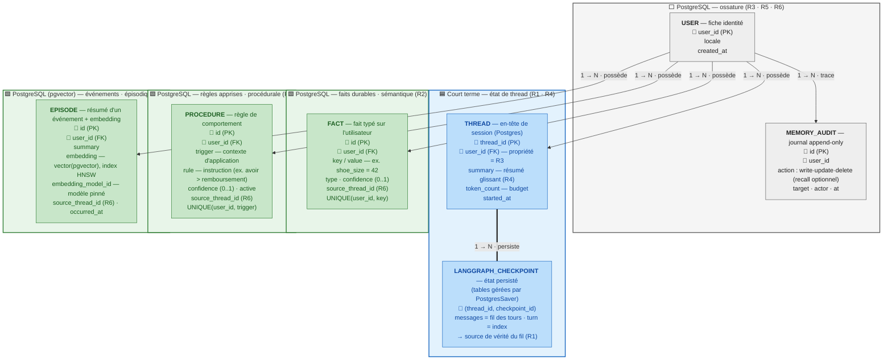
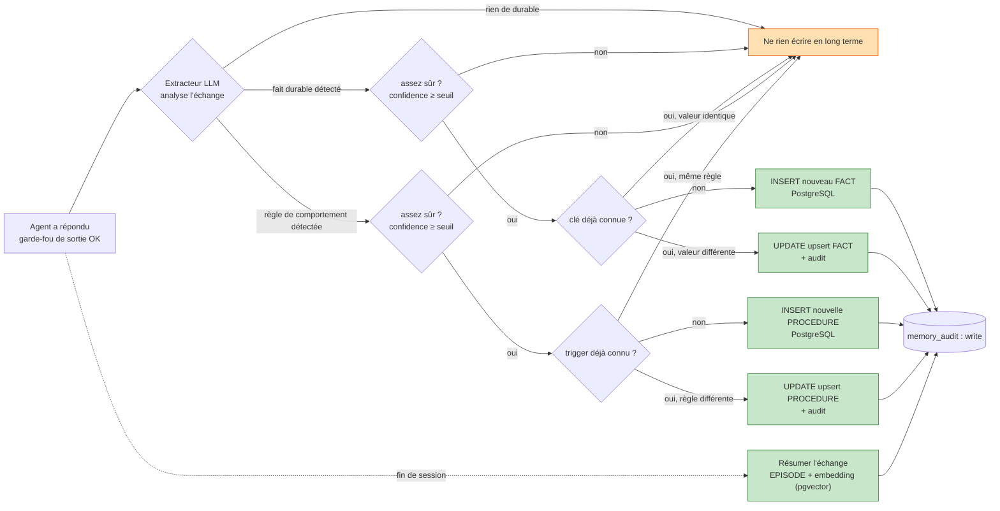

# Chantier 1 — Mémoire

> **Statut : document de conception.** Il fixe l'architecture cible et les contrats de
> données **avant** le code, pour que le code produit ensuite soit directement _prod-ready_.

## Stack

> ⚠️ **Contrainte de version décisive.** Le projet pin `langchain>=1.2,<2.0` (installé :
> 1.3.11). En **LangChain 1.x le module `langchain.memory` est supprimé** :
> `ConversationSummaryBufferMemory`, `RunnableWithMessageHistory` et
> `PostgresChatMessageHistory` **n'existent plus** dans cette stack. L'orchestration mémoire
> repose donc sur **LangGraph** (persistance de thread par _checkpointer_), pas sur les
> classes `*Memory` héritées de la 0.x.

| Brique         | Rôle dans la mémoire                                                                                                                                                                                                |
| -------------- | ------------------------------------------------------------------------------------------------------------------------------------------------------------------------------------------------------------------- |
| **LangGraph** _(dep à ajouter : `langgraph`, `langgraph-checkpoint-postgres`)_ | Orchestration du tour comme un `StateGraph` ; **persistance de l'état de thread** (messages + résumé + budget) via le checkpointer **`PostgresSaver`**. Remplace les classes `*Memory` supprimées. C'est **la** source de vérité du court terme — pas de table `MESSAGE` doublon. |
| **LangChain 1.x** (`langchain-core`, `langchain-azure-ai`) | Réduit à ce qui existe et sert : **client LLM Azure**, **sortie structurée** (`with_structured_output` + Pydantic pour l'extracteur), calcul d'embeddings. Pas d'abstraction mémoire. |
| **PostgreSQL** (extension **`pgvector`**) | Stockage relationnel cloisonné : **faits** sémantiques, **règles** procédurales, **métadonnées + embeddings d'épisodes**, **en-tête de thread**, **journal d'audit RGPD**. Les checkpoints LangGraph vivent aussi en Postgres (tables gérées par la lib). L'index vectoriel de la mémoire épisodique (embeddings + recherche par similarité HNSW) vit **dans la même base**, via `pgvector` — voir §Store épisodique. |
| **`EpisodicVectorStore`** (interface interne, implémentation `pgvector` par défaut) | Port d'accès à la recherche par similarité, **filtré par `user_id`** de façon non-contournable (client enveloppé, voir §R3). Découple le code appelant du store concret — une implémentation dédiée (ex. Chroma, Qdrant) reste substituable sans réécrire l'appelant, si un volume mesuré le justifie un jour (voir §Store épisodique). |

---

## Exigences à couvrir

| Réf.   | Exigence                                                                                                       | Nature                |
| ------ | -------------------------------------------------------------------------------------------------------------- | --------------------- |
| **R1** | Tenir 30+ tours sans perdre une info donnée au 1er tour                                                        | Court terme           |
| **R2** | Se souvenir d'une session à l'autre (jours plus tard) des faits/préférences durables                           | Long terme            |
| **R3** | Isolation stricte : la mémoire d'un utilisateur jamais accessible à un autre                                   | Transverse            |
| **R4** | Tenir la fenêtre de contexte : au-delà d'un budget de tokens, résumer/sélectionner sans perdre l'info critique | Court terme + travail |
| **R5** | Droit à l'oubli (RGPD) : suppression effective et vérifiable                                                   | Long terme            |
| **R6** | Traçabilité : inspecter ce que l'agent a retenu                                                                | Transverse            |

---

## Les trois types de mémoire et leur rôle

| Type                           | Durée de vie              | Contenu                                                               | Support (stack)                                                           |
| ------------------------------ | ------------------------- | --------------------------------------------------------------------- | ------------------------------------------------------------------------- |
| **Travail (working)**          | Le tour courant           | État transitoire : résumé glissant recomposé, souvenirs rappelés, budget tokens | En mémoire, dans le state LangGraph du tour — non persisté au-delà du checkpoint |
| **Court terme (conversation)** | Une session/thread        | Fil des tours (user/assistant/tool) + résumé + budget                 | **LangGraph checkpointer `PostgresSaver`** (état de thread persisté en Postgres) |
| **Long terme (persistant)**    | Illimitée (jusqu'à oubli) | Faits durables + règles procédurales + épisodes marquants             | **PostgreSQL** (faits + règles + métadonnées + embeddings d'épisodes via `pgvector`) |

<!-- **Lecture directe des exigences :**

- **R1** → court terme : tant que le thread tient dans le budget, l'info du tour 1 est littéralement présente. Au dépassement (30 tours), la mémoire de travail (résumé glissant + rappel long terme) prend le relais → **R4**.
- **R2** → long terme sémantique : préférences (« tutoie-moi », « client pro », n° de contrat) extraites en fin de session, rechargées à la session suivante via `user_id`.
- **R3** → propriété transverse : filtrage `user_id` sur PostgreSQL (toutes les tables, y compris les embeddings) (§5).
- **R4** → court terme + travail : résumé glissant (nœud LangGraph) + top-k recall pgvector (§4).
- **R5** → long terme : `DELETE` PostgreSQL (transaction unique, embeddings inclus) + audit (§5).
- **R6** → inspection listant tout le long terme d'un `user_id` (§5). -->

---

## Modèle de données de la mémoire

Trois natures de mémoire long terme :

- **Sémantique** — _faits durables_ (le « quoi ») : pointure, statut pro, n° de contrat, équipes suivies. Modélisés en **faits typés** dans PostgreSQL (`fact`), requêtés en direct (déterministe), tous réinjectés dans le prompt (petit volume).
- **Épisodique** — _ce qui s'est passé_ (le « quand/comment ») : « le 12/06 a signalé un défaut d'authenticité sur #A1832, escaladé ». Résumé **et** embedding stockés dans la **même table** PostgreSQL (`episode`, colonne `embedding` via `pgvector`), rappelé par similarité (top-k) au tour courant.
- **Procédurale** — _comment agir avec ce client_ (le « comment ») : une règle de comportement apprise, pas un fait sur lui ni un événement passé — ex. « proposer un avoir plutôt qu'un remboursement », « toujours reformuler les tailles en cm ». Modélisée en **règle typée** dans PostgreSQL (`procedure`), injectée comme instruction dans le prompt système avant que l'agent ne réponde (elle change le *comment répondre*, pas le contenu factuel réinjecté).

On retient **faits/règles typés + embeddings + métadonnées**, pas un simple clé-valeur nu : `type`, `confidence`, `source_thread_id` rendent R5/R6 réalisables.

> **Pourquoi séparer `fact` et `procedure` plutôt que tout mettre dans `fact` ?** Un `FACT` répond à *« qu'est-ce qui est vrai sur ce client ? »* (donnée réinjectée telle quelle dans le contexte). Une `PROCEDURE` répond à *« comment dois-je me comporter avec ce client ? »* (instruction injectée dans le système, qui pilote le comportement de l'agent). Mélanger les deux rendrait le prompt système ambigu — un fait n'est pas une consigne de comportement, et une règle n'a pas de `value` figée à afficher.



> **Légende des cartes :** la **couleur** encode le **type de mémoire** — 🟦 bleu = **court terme** · 🟩 vert = **long terme** (sémantique + procédurale + épisodique) · ⬜ gris = **transverse** (identité + audit). La mémoire de **travail** n'apparaît pas : elle n'est jamais stockée (voir plus bas).

### Comment lire ce schéma

Lecture des flèches :

- `USER → THREAD / FACT / PROCEDURE / EPISODE` (**possède**, 1 → N) → un **utilisateur** possède 0 à N de chacun ; chaque enfant appartient à un seul utilisateur (colonne `user_id`).
- `USER → MEMORY_AUDIT` (**trace**, 1 → N) → chaque action mémoire laisse une ligne de journal.
- `THREAD = LANGGRAPH_CHECKPOINT` (**persiste**, 1 → N, trait double) → l'en-tête de thread (Postgres) ↔ ses checkpoints d'état gérés par `PostgresSaver` ; **le fil des messages vit dans le checkpoint**, pas dans une table `MESSAGE` maison (on évite deux sources de vérité).

### Explication table par table (rattachée au type de mémoire)

Rappel des trois types : **court terme** (le fil de la conversation en cours), **long terme** (ce qui survit entre sessions), **travail** (calculé à la volée, non stocké — donc absent du schéma de données). Le schéma ci-dessus ne contient donc que du court terme, du long terme, et deux tables transverses (identité + audit).

#### 🟦 Court terme — « ce qui se dit maintenant » (R1, R4)

Objectif : garder le **fil** de la session en cours pour ne rien perdre pendant la conversation. Persisté pour survivre à un redémarrage, rattaché à un seul `thread_id` (une session).

- **`THREAD`** (Postgres) = l'en-tête d'une session, ce qu'on interroge en SQL.
  - `thread_id` (PK) : identifie la session. Un même utilisateur peut en avoir plusieurs.
  - `user_id` (FK) : à qui appartient la session → **isolation R3** ; c'est cette table qui rend l'appartenance d'un thread **interrogeable** (on ne charge jamais un thread dont le `user_id` ≠ utilisateur courant).
  - `summary` : le **résumé glissant** (R4), miroir SQL du champ d'état, pour l'inspection et la reprise.
  - `token_count` : la taille courante, pour savoir **quand** déclencher le résumé (R4).
  - `started_at` : horodatage de début.
- **`LANGGRAPH_CHECKPOINT`** (tables gérées par `PostgresSaver`, on ne les modélise pas à la main) = l'**état persisté du graphe** par `thread_id` : la liste des messages (le `turn` = leur index), le résumé et le budget courant. **C'est la source de vérité du fil** — on ne double pas avec une table `MESSAGE` maison (deux sources de vérité = risque de désynchronisation).

> **Pourquoi le checkpointer plutôt qu'une table `MESSAGE` maison ?** En LangChain 1.x les
> classes d'historique sont supprimées ; LangGraph **persiste nativement l'état du thread**
> (messages inclus) par `thread_id`, avec reprise après redémarrage gratuite. Une table
> `MESSAGE` en parallèle rejouerait le même contenu à deux endroits — à maintenir cohérents,
> pour rien. On garde une table légère `THREAD` seulement pour ce que le checkpointer ne rend
> pas interrogeable en SQL : l'**appartenance** (R3) et les **métadonnées** de session.

> **Pourquoi R1 (ne rien oublier en cours de conversation) tient :** tant que l'échange reste
> sous le budget de tokens, tous les messages de l'état sont **renvoyés tels quels** au
> modèle — l'info du 1er tour est encore là, mot pour mot. Au dépassement, un **nœud de
> résumé** LangGraph compresse les tours anciens dans `summary` (R4), et les faits critiques
> ont déjà été extraits **avant** compression (voir §R4).

#### 🟩 Long terme — « ce qu'on retient de l'utilisateur » (R2, R3, R5, R6)

Objectif : survivre **entre sessions** (jours plus tard). Trois sous-natures, d'où trois tables.

**Sémantique = les faits durables (le « quoi ») :**

- **`FACT`** = un fait typé sur l'utilisateur (pointure, statut pro, mode d'adresse, n° de contrat).
  - `id` (PK), `user_id` (FK) : propriété + **isolation R3**.
  - `key` / `value` : le couple clé-valeur (ex. `shoe_size` = `42`). C'est le cœur de **R2** : rechargé à la session suivante.
  - `type` : catégorie du fait (`preference` / `identity` / `order` / `dispute`) → permet de trier et de cibler l'oubli.
  - `confidence` (0..1) : à quel point on est sûr → seuil anti-pollution avant d'écrire.
  - `source_thread_id` : d'où vient ce fait → **traçabilité R6**.
  - `created_at` / `updated_at` : contrainte `UNIQUE(user_id, key)` → un fait par clé, mis à jour (upsert) plutôt que dupliqué.

> **Pourquoi une table classique et non une recherche par similarité vectorielle pour les faits ?**
>
> Un fait, c'est une information **nette et courte** (« pointure = 42 »). Pas besoin de « chercher par ressemblance » comme pour un épisode : on sait exactement quoi demander. Trois raisons de rester sur une requête exacte plutôt qu'un index vectoriel :
>
> - **Peu nombreux.** Un client a une poignée de faits, pas des milliers. On peut donc **tous les réinjecter** dans le prompt à chaque tour, sans trier.
> - **Réponse exacte et prévisible.** `SELECT ... WHERE user_id = X` renvoie **toujours** la bonne valeur, mot pour mot. Une recherche par similarité, elle, renvoie « ce qui ressemble le plus » — approximatif, inutile ici et risqué (elle pourrait rater le fait exact).
> - **Facile à cibler.** Comme chaque fait a une **clé** (`shoe_size`, `order_number`…), on peut en supprimer **un seul** proprement (**R5**, « oublie mon numéro de commande ») ou **tout lister** pour inspection (**R6**). Avec des vecteurs, viser une info précise serait bien plus fragile.
>
> Bonus : puisqu'un fait est stocké à part et toujours réinjecté, il **n'est jamais noyé dans un résumé** → l'info du tour 1 est protégée même à 30 tours (**R1**).

**Procédurale = comment agir avec ce client (le « comment ») :**

- **`PROCEDURE`** = une règle de comportement apprise pour cet utilisateur (« proposer un avoir plutôt qu'un remboursement », « reformuler les tailles en cm »).
  - `id` (PK), `user_id` (FK) : propriété + **isolation R3**.
  - `trigger` : le contexte d'application de la règle (ex. `refund_offer`, `size_mention`) → sert à ne l'injecter que quand c'est pertinent, sans polluer le prompt en permanence.
  - `rule` : l'instruction elle-même, en langage naturel court, écrite au système avant que l'agent ne réponde.
  - `confidence` (0..1) : même logique anti-pollution que pour `FACT` — un comportement mal inféré ne s'écrit pas.
  - `active` : booléen — permet de désactiver une règle obsolète sans forcément la supprimer (ex. remplacée par une règle plus récente sur le même `trigger`), distinct de la suppression physique R5.
  - `source_thread_id` : traçabilité **R6**. `created_at` / `updated_at` : `UNIQUE(user_id, trigger)` → une seule règle active par contexte, mise à jour (upsert) plutôt que dupliquée.

> **Pourquoi une table à part, et pas un `FACT` de plus ?** `FACT` décrit un **état** du client (« il fait du 42 ») ; `PROCEDURE` décrit une **consigne pour l'agent** (« dans ce cas, fais ceci »). La distinction compte au moment de construire le prompt : les faits sont des **données** réinjectées dans le contexte utilisateur, les règles sont des **instructions** injectées côté système. Les confondre risquerait de faire lire à l'agent une consigne de comportement comme une simple donnée client (ou l'inverse).
>
> **Pourquoi pas un embedding, comme un épisode ?** Une règle, comme un fait, est **peu nombreuse et précise** — on ne « cherche » pas la règle qui ressemble le plus, on applique **la** règle valable pour ce `trigger`. Table classique, `SELECT ... WHERE user_id = X AND active = true`, réponse déterministe.

**Épisodique = ce qui s'est passé (le « quand/comment ») :**

- **`EPISODE`** = le résumé d'un événement marquant d'une session (« le 12/06 litige d'authenticité sur #A1832, escaladé »), **et son embedding, dans la même ligne**.
  - `id` (PK), `user_id` (FK) : propriété + **isolation R3** — même mécanisme (`WHERE user_id = :current_user`) que `FACT`/`PROCEDURE`, pas un filtre à part.
  - `summary` : le texte lisible de l'épisode.
  - `embedding` : le vecteur (type `vector` de `pgvector`, index **HNSW**) servant à la **recherche par similarité** (retrouver les épisodes proches du message courant → top-k).
  - `embedding_model_id` : identifiant + version du modèle d'embeddings ayant produit ce vecteur (voir §Versioning du modèle d'embeddings).
  - `source_thread_id` : traçabilité **R6**. `occurred_at` : quand ça s'est passé.

> **Pourquoi une seule table (PostgreSQL + `pgvector`) plutôt qu'un store vectoriel séparé (ex. ChromaDB) ?**
>
> Texte et embedding d'un épisode sont **la même donnée sous deux formes** (lisible / vectorisée) — les séparer en deux stores n'apporte rien ici et coûte cher :
>
> - **Atomicité native.** Texte et vecteur vivent dans la **même ligne, même transaction** : un `DELETE` ou un `INSERT` ne peut pas réussir d'un côté et échouer de l'autre. Pas de risque de vecteur orphelin porteur de PII, pas de job de réconciliation à construire/opérer pour ce cas (voir §R5).
> - **Un seul périmètre de sécurité et d'exploitation.** Pas de 2ᵉ service réseau à exposer, authentifier, patcher, sauvegarder séparément — la mémoire épisodique hérite du même durcissement (accès, réseau, PITR) que le reste des données mémoire.
> - **Volume adapté au profil du projet.** L'index HNSW de `pgvector` tient aisément des dizaines de millions de vecteurs — largement suffisant pour une mémoire par client d'une boutique, pas un moteur de recherche à l'échelle du web.
>
> **Le choix n'est pas figé dans le code appelant.** L'accès passe par l'interface `EpisodicVectorStore` (§Stack) : si un projet dérivé de ce template atteint un volume où `pgvector` montre des signes de dégradation mesurés (latence de recherche p95, saturation mémoire de l'index), une implémentation dédiée (Chroma, Qdrant…) devient substituable **derrière la même interface**, sans réécrire l'appelant. Le choix se fait sur mesure réelle, pas sur un volume hypothétique anticipé.

#### ⬜ Transverse — « pas un souvenir, mais l'ossature »

- **`USER`** = la fiche identité. Point d'ancrage de **toutes** les FK `user_id` → c'est la table qui rend l'**isolation R3** possible et l'**oubli total R5** exécutable (suppression en cascade).
- **`MEMORY_AUDIT`** = le journal (append-only). Ne stocke aucun souvenir métier, mais **trace les écritures** (`write` / `update` / `delete`). C'est l'organe de **R6** (inspecter ce que l'agent a fait) et la **preuve de suppression** pour **R5**. Le `recall` (lecture) est journalisé **en option** : le tracer systématiquement gonflerait vite le journal, on ne l'active que si un audit fin des accès est requis.

#### ⬛ Travail (working) — absent du schéma, et c'est normal

La mémoire de **travail** (résumé recomposé, top-k épisodes rappelés, budget calculé) n'est **jamais persistée durablement** : elle vit le temps d'un tour dans le state LangGraph, puis disparaît (au-delà du checkpoint). Elle n'a donc pas de table dédiée. Elle **consomme** le court terme et le long terme pour fabriquer le prompt (R4), mais ne s'écrit pas.

<!-- **Glossaire des verbes de relation (sens technique) :**

| Verbe      | Terme technique                                                                                 | Signification                                                                                                                                                                                                                                                                  |
| ---------- | ----------------------------------------------------------------------------------------------- | ------------------------------------------------------------------------------------------------------------------------------------------------------------------------------------------------------------------------------------------------------------------------------ |
| `possede`  | **Relation 1-N par clé étrangère** (`USER.user_id` → FK dans la table enfant)                   | La table enfant porte `user_id` référençant `USER`. Association de propriété : chaque ligne enfant appartient à un et un seul utilisateur. Support de l'**isolation multi-tenant** (R3) : tout accès est filtré `WHERE user_id = :current_user`.                               |
| `persiste` | **Persistance d'état par checkpointer** (`THREAD.thread_id` ↔ `LANGGRAPH_CHECKPOINT`, PostgresSaver) | Le fil des messages est l'état du graphe persisté par `thread_id` (LangGraph) ; supprimé avec le thread (R5 : purge des checkpoints).                                                                                                                               |
| `trace`    | **Journalisation / audit trail** (append-only, `MEMORY_AUDIT.user_id`)                          | Chaque opération mémoire (write/update/recall/delete) écrit une entrée immuable horodatée. Table **append-only** servant de piste d'audit RGPD pour la traçabilité (R6) et la preuve de suppression (R5).                                                                      |

**Store épisodique (`pgvector`) :** `EPISODE` (PostgreSQL) porte le texte + métadonnées + l'embedding, dans la **même ligne** — plus de relation cross-store à documenter (voir §Store épisodique).
 -->

---

## Tenir la fenêtre de contexte (R4)

Trois leviers combinés :

1. **Fenêtre glissante brute** — tant que `token_count < budget`, tous les tours de l'état LangGraph sont envoyés tels quels (zéro perte).
2. **Résumé glissant** — au dépassement, un **nœud de résumé** LangGraph compresse les tours anciens (au-delà des N derniers) et **élague** l'état. Prompt = `système + summary + faits + top-k épisodes + N derniers tours bruts`.

   > **Précision de mise en œuvre :** le résumé est calculé par un appel LLM dédié dans le nœud, puis écrit **dans l'état du graphe** (donc persisté par le checkpointer) **et** recopié dans `THREAD.summary` (miroir SQL interrogeable). Il survit ainsi au redémarrage et à la reprise. **Le résumé est un cache, pas la vérité** : les tours bruts restent dans les checkpoints tant qu'ils n'ont pas été élagués ; on **borne la profondeur de re-résumé** (pas de résumé-de-résumé-de-résumé) pour limiter la perte cumulative.

3. **Sélection par pertinence** — faits et règles procédurales actives : tous réinjectés (déterministe, `SELECT ... WHERE user_id` sur PostgreSQL). Épisodes : **top-k** proches du message courant via `EpisodicVectorStore` (implémentation `pgvector`) filtré `user_id`.

**Éviter de perdre l'info critique en résumant :**

- **Extraction avant compression** : avant de résumer un bloc, on en extrait d'abord les **faits typés** (pointure, n° commande, litige) et les **règles de comportement** (préférence exprimée sur comment traiter une situation) vers PostgreSQL. L'info critique quitte le texte volatil → elle survit au résumé.
- **Prompt de résumé orienté rétention** : consigne de préserver identifiants, chiffres, engagements, litiges ; interdiction de résumer les entités nommées.
- **Les faits et les règles procédurales ne sont jamais résumés** : toujours réinjectés intégralement (les uns comme données, les autres comme instructions système) → info du tour 1 protégée à 30+ tours (**R1**).

<!-- > Test visé : « info du tour 1 restituée au tour 30 » → garanti par extraction de faits + réinjection systématique, indépendamment du résumé. -->

---

## Isolation (R3), oubli (R5), traçabilité (R6)

### R3 — Isolation stricte

- `user_id` **obligatoire et indexé** sur `thread`, `fact`, `procedure`, `episode` (PostgreSQL, y compris la colonne `embedding`) — **un seul mécanisme d'isolation** pour toute la mémoire long terme, pas un filtre séparé côté vectoriel. Le fil court terme est isolé via l'**appartenance du thread** (`THREAD.user_id`) : on ne charge un checkpoint que pour un `thread_id` appartenant à l'utilisateur courant.
- **Filtre non-contournable, pas seulement recommandé.** Le client d'accès (`EpisodicVectorStore` comme les accès `FACT`/`PROCEDURE`) est **enveloppé** de sorte qu'une requête sans `WHERE user_id = :current_user` soit **impossible à émettre** (méthode d'accès unique qui exige le `user_id`), plutôt qu'une convention qu'un futur appel pourrait oublier. Un filtre oublié = fuite inter-clients.
  - **Renforcement du non-contournable, pas seulement une convention de code review** : un import direct du driver Postgres brut (hors du wrapper) est **interdit en CI** (règle `import-linter`/Ruff dédiée bloquant l'import hors du module d'accès) — détecté avant merge, indépendamment de la vigilance du relecteur. Le client brut vit dans un sous-module non exporté (`_internal`), jamais dans le namespace public du module mémoire.
- `user_id` vient de la **session authentifiée**, **jamais du contenu du message** (sinon injection « je suis l'utilisateur X » — voir le cas d'acceptance dédié §Couverture).
- **Row-Level Security PostgreSQL : recommandée si l'infrastructure le permet, pas une garantie dure.** RLS suppose que chaque requête porte le `user_id` courant au niveau de la session Postgres (`SET LOCAL` par transaction) — avec un pool de connexions partagé (pgbouncer en mode transaction, pool applicatif), un `SET` mal isolé peut fuiter vers la requête suivante servie par la même connexion, ce qui **inverserait** l'objectif recherché. Le filtre applicatif enveloppé ci-dessus est donc la **seule garantie dure** de R3, testée et déterministe ; RLS reste une défense en profondeur optionnelle, à activer seulement si le mode de pooling la rend sûre.

### R5 — Droit à l'oubli (effectif et vérifiable)

| Demande                           | Action                                                                                                                                                                                                     |
| --------------------------------- | ---------------------------------------------------------------------------------------------------------------------------------------------------------------------------------------------------------- |
| « oublie mon numéro de commande » | `DELETE FROM fact WHERE user_id=:u AND key='order_number'` + suppression des épisodes le mentionnant (texte **et** embedding, même ligne) + scrub du fil court terme (voir plus bas) — **une seule transaction Postgres** |
| « arrête de me proposer un avoir » | `DELETE FROM procedure WHERE user_id=:u AND trigger='refund_offer'` + `memory_audit(action='delete')` — même transaction                                                                                  |
| Effacement total                  | `DELETE` en cascade `thread`/`fact`/`procedure`/`episode` (embeddings inclus) + purge des **checkpoints** du thread (`PostgresSaver.delete_thread`) — **une seule transaction Postgres**                  |

- **Effective :** suppression **physique** (DELETE), pas un flag.
- **Atomicité native.** Toutes les données mémoire (faits, règles, épisodes **et leurs
  embeddings**, checkpoints) vivent dans **une seule base Postgres** — la suppression est **une
  transaction unique**, pas de risque de désynchronisation cross-store, pas de job de
  réconciliation à opérer. C'est un bénéfice direct du choix `pgvector` plutôt qu'un store
  vectoriel séparé (§Store épisodique) : la complexité d'un delete cross-store n'existe
  simplement pas ici.
- **Scrub du fil court terme.** Effacer un identifiant cité en **texte libre** dans les
  messages est flou : le défaut prod est de **purger le(s) checkpoint(s) du thread concerné**
  (suppression nette) plutôt qu'un scrub regex fragile. Un scrub partiel n'est retenu que si la
  session doit continuer, avec un mécanisme explicite et ses limites documentées.
- **Course oubli ↔ écriture tardive (RGPD) — indépendante du choix de store.** L'extracteur
  écrit en **asynchrone après le tour** : un write extracteur arrivant **après** un `DELETE` R5
  **ressusciterait** la donnée, que le store soit unique ou cross-store — ce risque tient à
  l'asynchronie de l'extracteur, pas à l'architecture de stockage. Parade : l'oubli pose un
  **tombstone** (`memory_audit` + clé bloquée) que l'extracteur **consulte avant tout write** —
  une clé/trigger sous tombstone reste bloquée **tant que l'écriture qui l'a posé n'est pas
  confirmée résolue des deux côtés du flux** (pas de TTL calendaire fixe : le tombstone se ferme
  quand l'état est confirmé, point).
- **Vérifiable :** chaque suppression écrit `memory_audit(action='delete')` ; le test rejoue la
  question après oubli et vérifie que l'info **ne ressort plus** (cas d'acceptance R5).

### R6 — Traçabilité / inspection

- Commande `inspect_memory(user_id)` : `SELECT` de tous les `fact` + `procedure` + `episode` PostgreSQL de l'utilisateur, avec `source_thread_id` et horodatages.
- `memory_audit` journalise les écritures (write/update/delete ; recall en option) → prouve _quand_ et _d'où_ vient un souvenir, et _quand_ il a été effacé.

---

## Qui écrit, quand, quoi retenir

### Qui décide ? Deux décideurs distincts

| Mémoire         | Qui juge                                                                                   | Quand                                               | Jugement                                    |
| --------------- | ------------------------------------------------------------------------------------------ | --------------------------------------------------- | ------------------------------------------- |
| **Court terme** | Personne — écriture **automatique**                                                        | À **chaque tour**                                   | **Aucun** : tout message est écrit tel quel |
| **Long terme**  | Un **extracteur** = second appel LLM (« memory writer »), **séparé** de l'agent qui répond | **Après** la réponse (fin de tour + fin de session) | **Oui** : décide durable vs éphémère        |

Point clé : le « juge » de la mémoire long terme n'est **ni l'agent principal, ni un humain**, mais un **composant LLM dédié** qui tourne en post-traitement. On sépare _répondre_ (agent) et _mémoriser_ (extracteur) pour que le jugement de rétention n'interfère pas avec la réponse au client.

> **Quel modèle pour l'extracteur ?** Pas le modèle de chat (Mistral-Large-3) — tâche étroite et structurée (JSON court, faits/règles), pas de génération conversationnelle. Décision **révisée** : **`claude-opus-4-5` via Azure AI Foundry**, partagé avec le juge DeepEval Qualité (Ch.3) — un **3ᵉ modèle/vendor**, distinct de Mistral-Large-3 (agent) et `gpt-5-mini` (juge garde-fous, Ch.2). Écart assumé par rapport à la décision initiale (réutiliser `gpt-5-mini` pour éviter un 3ᵉ modèle à qualifier, cf. [`schemas/04-outils.md`](../schemas/04-outils.md)) : le juge DeepEval Qualité **gate la release** (`--min-score 0.8`, Ch.3) — sa fiabilité pèse plus lourd que l'économie d'un endpoint en moins, et l'extracteur en hérite via le déploiement partagé plutôt que de qualifier un 4ᵉ modèle pour lui seul.
>
> **Déploiement Azure AI Foundry : partagé avec DeepEval (Ch.3), mais séparé du juge garde-fous.**
> L'extracteur et le juge DeepEval sont tous deux **asynchrones/best-effort** — ils peuvent
> partager un même déploiement (même quota) sans risque mutuel. Le juge garde-fous, lui,
> est sur le **chemin bloquant synchrone** (chaque message) : il a son **propre déploiement**
> Azure OpenAI (`gpt-5-mini`), quota isolé, pour qu'un pic d'extraction ou une nuit de suite
> DeepEval ne throttle jamais le garde-fou (détail au
> [chantier 2](conception_chantier2_guardrails.md#stack)). Contrepartie assumée : le déploiement
> mémoire (Ch.1) reste couplé à celui de DeepEval (Ch.3) sur le même modèle/quota — acceptable
> car les deux usages partagent le même profil de criticité (async, tolérant à la latence). Sans
> lien avec `get_llm()` par défaut (Mistral-Large-3, hors-ligne = `EchoLLM`) : l'extracteur
> reçoit son **propre client `LLM` injecté** au constructeur, indépendant du modèle de réponse
> client et du résumé glissant.

### Le flux de décision (à chaque fin de tour)



### Quoi retenir vs jeter (exemples)

| Message client                               | Décision extracteur             | Où                                  |
| -------------------------------------------- | ------------------------------- | ----------------------------------- |
| « je fais du 42 »                            | **Retenu** — contrainte stable  | `FACT` (key=`shoe_size`)            |
| « tutoie-moi »                               | **Retenu** — préférence durable | `FACT` (key=`address_mode`)         |
| « je suis client pro, contrat #C-8841 »      | **Retenu** — identité/statut    | `FACT` (type=`identity`)            |
| « le maillot reçu est un faux, je conteste » | **Retenu** — litige ouvert      | `FACT` (type=`dispute`) + `EPISODE` |
| « la dernière fois j'ai préféré un avoir à un remboursement » | **Retenu** — règle de comportement | `PROCEDURE` (trigger=`refund_offer`) |
| « merci, bonne journée »                     | **Jeté** — small talk           | —                                   |
| « attends je regarde mon panier »            | **Jeté** — état transitoire     | —                                   |
| « c'est bon j'ai trouvé, oublie »            | **Jeté** — déjà résolu          | —                                   |

### Règles du décideur

L'extracteur suit cinq règles simples. À l'oral, on peut les résumer ainsi : **« quand analyser, quoi garder, quoi jeter, éviter les erreurs, éviter les doublons. »**

- **1. Quand il travaille.** L'extracteur ne tourne pas pendant que l'agent parle, mais **après** : en fin de tour (pour repérer un fait ou une règle de comportement) et en fin de session (pour résumer l'échange en un épisode, embeddé et stocké via `pgvector`). On sépare _répondre_ et _mémoriser_.

- **2. Ce qu'il garde (durable).** Tout ce qui sera **encore utile dans une future session**, sous deux formes :
  - des **faits** (`FACT`) : identité/statut (client pro, n° de contrat), contraintes stables (pointure, équipes suivies), litiges et engagements ouverts. Règle mentale : _« est-ce vrai encore demain ? » → oui = on garde._
  - des **règles de comportement** (`PROCEDURE`) : une consigne sur *comment* traiter ce client à l'avenir (« proposer un avoir plutôt qu'un remboursement », « reformuler les tailles en cm »), déduite d'une correction ou d'une préférence exprimée. À ne pas confondre avec une préférence-fait comme le tutoiement (`FACT`, `key=address_mode`) : le tutoiement est une donnée à afficher/appliquer littéralement, une procédure est une consigne de décision face à une situation récurrente. Règle mentale : _« est-ce que ça change comment je dois **décider** la prochaine fois ? » → oui = on garde en procédure._

- **3. Ce qu'il jette (éphémère).** Tout ce qui ne sert qu'au moment présent : politesses, reformulations, « attends je regarde », infos déjà résolues. _« vrai seulement maintenant ? » → oui = on jette._

- **4. Comment il évite les erreurs (le seuil de confiance).** Deux acteurs distincts :
  - le **LLM** produit, pour chaque fait ou règle détecté, un **score de confiance** entre 0 et 1 (« à quel point suis-je sûr ? ») ;
  - **nous** (la config) fixons une seule fois une **barre** — le `seuil`, ex. 0,7 — inscrite dans la configuration de l'agent.

  Le code compare simplement `score ≥ seuil`. Au-dessus → on écrit ; en dessous → on jette par prudence.
  _Exemple : « je fais du 42 » → score ~0,95 → écrit. « je crois que je faisais du 42 avant… » → score ~0,4 → non écrit_ (trop flou, on évite de mémoriser une bêtise).

  <!-- **Comment c'est fait, concrètement (3 outils, 3 rôles) :**
  1. **LangChain** force le LLM à répondre en JSON structuré (`with_structured_output` + un schéma Pydantic). Le champ `confidence` fait partie du schéma que le modèle doit remplir — c'est ainsi que le LLM « rend » son score.
  2. **Python** compare au seuil : un simple `if fact.confidence >= SEUIL:`. Aucun outil dédié, juste une constante que l'on choisit.
  3. **PostgreSQL** range le fait retenu (colonne `fact.confidence`).

  ```python
  from pydantic import BaseModel, Field

  class ExtractedFact(BaseModel):
      key: str
      value: str
      type: str
      confidence: float = Field(ge=0, le=1, description="À quel point es-tu sûr ?")

  SEUIL = 0.7  # notre barre, fixée dans la config

  extractor = llm.with_structured_output(ExtractedFact)   # LangChain
  fact = extractor.invoke(conversation)                   # le LLM remplit confidence

  if fact.confidence >= SEUIL:                            # Python
      save_fact(fact)                                     # INSERT PostgreSQL
  ```

  | Étape                   | Outil                                               |
  | ----------------------- | --------------------------------------------------- |
  | Le LLM renvoie le score | **LangChain** (`with_structured_output` + Pydantic) |
  | Comparer au seuil       | **Python** (`if`)                                   |
  | Ranger le fait          | **PostgreSQL**                                      | -->

- **5. Éviter les doublons.** La contrainte `UNIQUE(user_id, key)` sur `FACT` (resp. `UNIQUE(user_id, trigger)` sur `PROCEDURE`) garantit **un seul fait par clé** (resp. **une seule règle active par contexte**) : si l'adresse change, ou si la règle est révisée, on **écrase** l'ancienne valeur (upsert) au lieu d'empiler des doublons. Le journal `memory_audit` garde quand même la trace du changement.

> **Limite du dédoublonnage par clé exacte.** `UNIQUE(user_id, key)` ne dédoublonne que si le
> LLM émet **la même clé**. « pointure » vs `shoe_size` vs `size` créeraient trois faits. Donc
> le schéma d'extraction **contraint `key` à un vocabulaire fermé** (enum Pydantic :
> `shoe_size`, `address_mode`, `order_number`, `pro_status`…) — le LLM range dans une clé
> connue ou n'écrit pas. Même logique de `trigger` fermé pour `PROCEDURE`.

---

## Robustesse & paramètres tranchés (prod-ready)

### Contrat de démarrage — pas de repli silencieux vers un LLM mock

`get_llm()` bascule sur `EchoLLM` (mock hors-ligne) dès que la configuration Azure est
absente — comportement voulu en dev/CI local, **inacceptable en production** si rien ne le
distingue explicitement : un déploiement mal configuré (variable d'environnement manquante,
secret non injecté) démarrerait normalement et servirait du contenu mock à de vrais clients,
sans log ni alerte.

Contrat **non négociable** :

- En environnement de **production**, l'absence de configuration LLM (Azure ou tout autre
  provider retenu) **empêche le démarrage** (fail-fast), plutôt que de retomber sur `EchoLLM`.
  La distinction d'environnement (`ENVIRONMENT=production` vs dev/CI) vit dans la config
  centralisée (`velmo.config`).
- Si `EchoLLM` est malgré tout instancié (dev/CI volontaire), un **warning explicite** est
  loggé à chaque instanciation — pour qu'un repli non voulu soit visible immédiatement, pas
  découvert après coup.

### Contrat d'échec de l'extracteur

L'extracteur est un appel LLM distant qui **échouera** parfois (timeout, content-filter,
service down — cf. incidents réels du chantier). Contrat **non négociable** :

- L'échec de l'extracteur **n'affecte jamais la réponse au client** : la réponse est déjà
  envoyée, l'extraction est un **post-traitement best-effort**.
- Un échec d'extraction/compression **ne corrompt pas** le tour courant ni l'état persisté :
  l'écriture mémoire est **isolée** (try/except autour du nœud extracteur), **journalisée**
  (`memory_audit` note l'échec) et **rejouable** (file de retry), jamais bloquante.

### Calibration du seuil de confiance

Le `seuil = 0,7` est un **point de départ, pas une vérité** : la confidence **auto-déclarée**
par un LLM est **mal calibrée** (un modèle peut être « sûr » et faux). Donc : le seuil sert de
**filtre grossier**, et on le **valide sur un petit set labellisé** — même démarche que la
calibration des seuils du _chantier 3_. On documente la valeur retenue **dans la config** (donc
hashée dans la version d'agent).

**Le set labellisé lui-même** (`eval/memory_confidence_cases.jsonl`) : une trentaine d'échanges
fabriqués à la main, même format que `guardrail_cases.jsonl`, annotés « à retenir / à jeter » —
couvrant les cas limites déjà listés en exemple (§Quoi retenir vs jeter). **Propriétaire** :
même rôle que l'owner de `guardrails/scope_policy.yaml` (Ch.2) — un seul responsable arbitre les
seuils métier mémoire et garde-fous. **Refresh** : dès que du vrai trafic existe, le jeu
synthétique est progressivement remplacé par des cas réels anonymisés (même logique anti-
overfitting/hold-out que le Chantier 3).

### Rétention & purge — deux finalités RGPD distinctes, deux durées

Deux données différentes, deux buts, donc **deux durées de rétention** — les confondre
reviendrait à garder le verbatim complet aussi longtemps que sa version minimisée, ce qui
défait l'intérêt même d'avoir résumé :

- **Épisodes (résumé + embedding)** — servent la **personnalisation entre sessions** (R2), un
  usage légitimement long et déjà minimisé par construction. **TTL 24 mois** (configurable) +
  **job de purge** audité, `DELETE` unique (texte + embedding, même ligne — atomique par
  construction, cf. §Store épisodique).
- **Fil brut (`THREAD` + checkpoints LangGraph)** — sert à soutenir **la conversation en cours**
  et, après clôture, une fenêtre de **preuve/litige** (authenticité, chargeback carte) : un
  usage plus court et plus ponctuel que la personnalisation. **TTL 90 jours d'inactivité**
  (pas un âge absolu — un thread actif à J+91 n'est pas purgé), purge via
  `PostgresSaver.delete_thread` (même chemin idempotent que R5). À inscrire comme un **2ᵉ usage
  distinct** au registre de traitement RGPD, à côté de celui des épisodes.

### Versioning du modèle d'embeddings

Le modèle d'embeddings est **pinné** (id + version), comme tout autre modèle de la stack : un
changement de modèle rend les vecteurs déjà stockés **incompatibles** avec les nouvelles
requêtes (distances non comparables entre générations d'embeddings) — un top-k mélangeant
ancien et nouveau modèle renverrait des scores de similarité incohérents entre eux,
silencieusement. `embedding_model_id` est stocké sur chaque `EPISODE` (§Modèle de données). En
cas de changement de modèle : **ré-embedding batch** de tous les épisodes existants avant
bascule (job explicite, jamais un mélange de deux générations dans la même recherche).

### Secrets, sauvegarde, accès — fondations opérationnelles

- **Secrets** : variables d'environnement en dev/CI (jamais committées) ; en production, secrets
  injectés par la plateforme de déploiement, jamais un fichier. Azure Key Vault en option future
  si le budget le permet (cohérent avec l'écosystème Azure déjà utilisé). **Séparation stricte
  staging/production** : credentials distincts, jamais partagés. `validate_startup()` doit
  refuser un secret vide/par défaut en environnement de production.
- **Sauvegarde / PITR.** Postgres est la **source de vérité unique** de toute la mémoire
  (faits, règles, épisodes, checkpoints, audit) — sa perte est la perte simultanée de tout.
  **Point-In-Time Recovery activé** (Azure Database for PostgreSQL), rétention des sauvegardes
  alignée sur la contrainte la plus longue du projet (24 mois), **test de restauration**
  périodique (avant mise en prod, puis annuel). Une restauration peut ressusciter un utilisateur
  « oublié » R5 : risque documenté, pas ignoré.
- **Accès interne (RBAC léger).** R3 protège un client d'un autre ; rien ne distingue en interne
  qui, côté équipe, peut lire quoi. Principe documenté dès maintenant (rôles Postgres séparés :
  applicatif complet vs lecture restreinte pour du support/debug futur), sans construire
  l'outillage complet tant que l'équipe reste solo — juste ne pas bâtir une architecture qui
  empêcherait de l'étendre plus tard.

### Paramètres tranchés (ex-« questions ouvertes »)

Un doc prod-ready ne laisse pas de TODO de conception. Valeurs de départ :

| Paramètre                         | Valeur de départ                         | Justification |
| --------------------------------- | ---------------------------------------- | ------------- |
| Budget de tokens (portion historique) | **8 000 tokens**                     | Marge sous la fenêtre du modèle, laisse la place aux faits/épisodes/système. |
| Taille N de la fenêtre brute conservée | **10 derniers tours**                | Assez pour la cohérence locale ; au-delà → résumé. |
| Seuil `confidence` d'écriture      | **0,7** (à calibrer sur `memory_confidence_cases.jsonl`) | Filtre grossier, affiné sur set labellisé. |
| Store épisodique                   | **`pgvector`** (index HNSW, filtre `user_id` non-contournable) | Une seule base, atomicité native ; interface `EpisodicVectorStore` substituable si le volume le justifie un jour. |
| Rétention épisodes                 | **TTL 24 mois + purge auto audité**      | Minimisation RGPD (personnalisation entre sessions). |
| Rétention fil brut (thread/checkpoints) | **TTL 90 jours d'inactivité**        | Minimisation RGPD (soutien conversation + fenêtre de preuve/litige, usage plus court que les épisodes). |
| Profondeur max de re-résumé        | **bornée**                               | Évite la perte cumulative (résumé de résumé). |

---

## Couverture des exigences

| Exigence | Mécanisme (stack)                                                                                                                                                                   | Test d'acceptance                                              |
| -------- | ----------------------------------------------------------------------------------------------------------------------------------------------------------------------------------- | -------------------------------------------------------------- |
| **R1**   | État LangGraph renvoyé tel quel sous budget + faits PostgreSQL réinjectés                                                                                                           | Info tour 1 restituée au tour 30                               |
| **R2**   | Faits + règles procédurales + épisodes (embeddings `pgvector`), tous PostgreSQL, rechargés par `user_id`                                                                            | Retour plus tard, agent se souvient                            |
| **R3**   | `user_id` filtré partout (accès Postgres **non-contournable**, un seul mécanisme) + `user_id` = session, jamais le message | Deux users, aucune fuite **+ injection « je suis X » repoussée** |
| **R4**   | Budget dépassé → nœud de résumé LangGraph (persisté dans l'état + `THREAD.summary`) + top-k épisodes (`pgvector`) + extraction des faits/règles **avant** compression | Conversation **franchissant le budget** : info critique du tour 1 restituée **après** résumé |
| **R5**   | `DELETE` Postgres en **transaction unique** (faits, règles, épisodes+embeddings, checkpoints) + tombstone anti-résurrection | « oublie mon n° » → ne ressort plus, même après write extracteur tardif |
| **R6**   | `inspect_memory` + `memory_audit` (PostgreSQL)                                                                                                                                      | Inspection du contenu retenu (fait + `source_thread_id` + horodatage) |

> **Trous de couverture R4/R6 comblés.** `eval/memory_cases.jsonl` n'avait aucun cas R4 ni R6.
> Ils sont ajoutés (voir ci-dessous) : R4 = conversation **au-dessus du budget** forçant la
> compression, R6 = **inspection** vérifiant qu'un fait écrit est listable avec sa provenance.

---

## Décisions de conception

| Question                                                       | Décision                                                                                                            | Pourquoi |
| ------------------------------------------------------------- | ------------------------------------------------------------------------------------------------------------------ | -------- |
| Orchestration mémoire : abstractions LangChain ou LangGraph ? | **LangGraph** (`StateGraph` + checkpointer `PostgresSaver`)                                                        | En LangChain 1.x le module `langchain.memory` est **supprimé** ; LangGraph persiste nativement l'état de thread (reprise après crash gratuite). |
| Fil des messages : table `MESSAGE` maison ou checkpointer ?   | **Checkpointer** (source de vérité unique), table légère `THREAD` pour l'appartenance/métadonnées seulement        | Une table `MESSAGE` en parallèle du checkpoint = deux sources de vérité à garder cohérentes, pour rien. |
| `FACT` et `PROCEDURE` : une table ou deux ?                   | **Deux tables**                                                                                                     | Un fait est une **donnée** réinjectée dans le contexte ; une règle est une **instruction** injectée au système — les confondre rend le prompt ambigu. |
| Faits/règles : requête exacte ou recherche par similarité ?   | **Table classique PostgreSQL** (requête exacte)                                                                     | Peu nombreux, précis, à réponse déterministe et ciblable (R5/R6) — une recherche par similarité renverrait « ce qui ressemble », approximatif et risqué. |
| Store des épisodes ?                                           | **`pgvector`** — une seule base, atomicité native, interface `EpisodicVectorStore` substituable                     | Texte et embedding sont la même donnée sous deux formes : les séparer (ex. Chroma) coûte un service réseau, une surface de sécurité et une réconciliation en plus, pour un volume (mémoire par client) que `pgvector` couvre largement. Migration possible derrière l'interface si le volume mesuré le justifie un jour. |
| Qui décide de mémoriser en long terme ?                       | Un **extracteur LLM dédié** (`claude-opus-4-5`, Azure AI Foundry), séparé de l'agent, en **post-traitement best-effort**                   | Séparer *répondre* et *mémoriser* ; son échec ne bloque jamais la réponse (contrat d'échec). Déploiement **partagé avec DeepEval (Ch.3)**, séparé du juge garde-fous (Ch.2, Azure OpenAI `gpt-5-mini`) — profils de criticité différents. |
| Isolation R3 : convention ou garantie ?                       | **Filtre `user_id` non-contournable** (client enveloppé + import direct interdit en CI) ; RLS **rétrogradée en option** | Un seul mécanisme, testé et déterministe ; RLS suppose un `SET` par session compatible avec le pooling de connexions — pas garanti, donc pas une garantie dure. |
| Oubli R5 : flag ou suppression physique ?                     | **Suppression physique**, **transaction Postgres unique** (bénéfice direct de `pgvector`) + **tombstone** anti-résurrection | Effectif et vérifiable (RGPD) ; plus de risque cross-store à réconcilier. Le tombstone reste nécessaire pour une autre raison : la course avec l'extracteur asynchrone, indépendante du store. |
| Seuil de confidence d'écriture ?                              | **Filtre grossier (0,7) calibré sur `memory_confidence_cases.jsonl`** (~30 cas synthétiques), valeur dans la config | La confidence auto-déclarée par un LLM est mal calibrée ; un seuil deviné mémoriserait des bêtises ou jetterait du vrai. |
| Rétention des épisodes vs du fil brut ?                       | **24 mois (épisodes) / 90 jours d'inactivité (thread+checkpoints)** — deux durées distinctes                       | Deux finalités RGPD différentes (personnalisation vs preuve/litige) ; les confondre garderait le verbatim aussi longtemps que sa version minimisée. |
| Versioning du modèle d'embeddings ?                           | **`embedding_model_id` pinné** par épisode, ré-embedding batch si changement de modèle                             | Mélanger deux générations d'embeddings dans une même recherche de similarité produit des scores incohérents, silencieusement. |
| Config LLM absente en prod : repli mock ou refus de démarrer ? | **Fail-fast en production** (pas de repli `EchoLLM` silencieux) ; warning explicite si `EchoLLM` instancié en dev/CI | Un repli mock non distingué de la prod servirait du contenu factice à de vrais clients sans qu'aucune alerte ne se déclenche. |
| Secrets : où et comment ?                                     | **Env vars** (dev/CI et injection plateforme en prod), Key Vault en option future, séparation stricte staging/prod | Éviter le commit accidentel d'une clé et le partage de credentials entre environnements. |
| Sauvegarde de Postgres (source de vérité unique) ?            | **PITR activé** (Azure Database for PostgreSQL), rétention alignée sur 24 mois, test de restauration périodique     | Une perte de cette base perd simultanément mémoire, preuve RGPD et journal de sécurité — aucun des 3 docs ne l'adressait initialement. |
| Accès interne aux données sensibles (équipe, pas client) ?    | **Principe RBAC documenté** (rôle applicatif vs lecture restreinte), pas d'outillage lourd construit tant que solo | Proportionné à une équipe d'une personne aujourd'hui, sans bloquer une extension future. |

