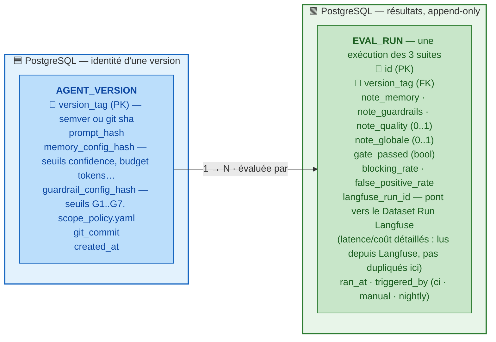
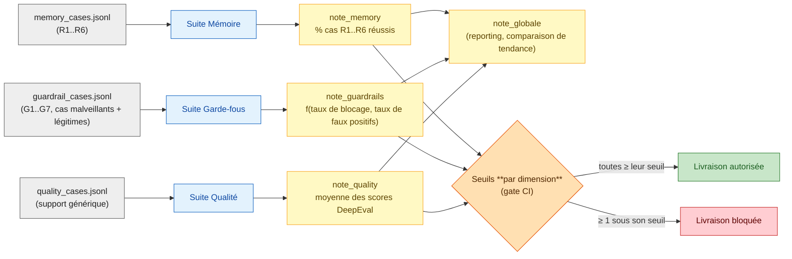
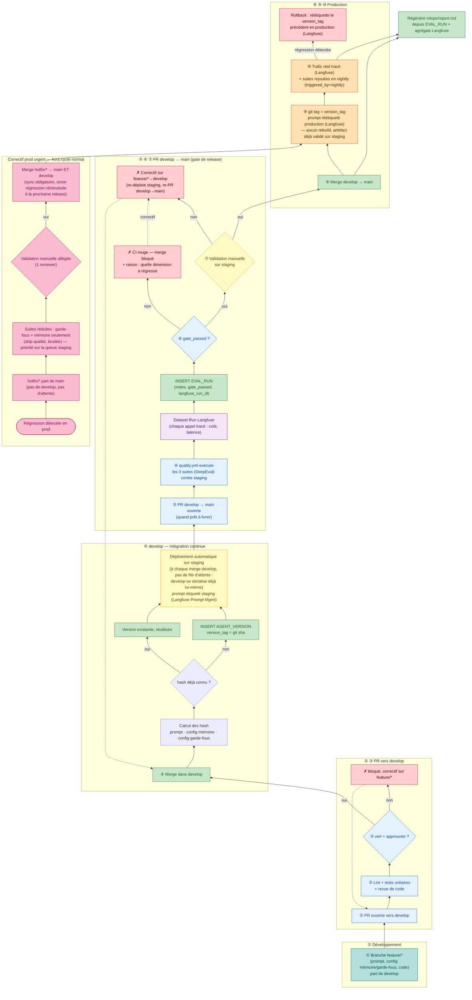

# Chantier 3 — Évaluation & MLOps

## Stack

| Brique                               | Rôle dans l'évaluation                                                                                                                                                                                                                                                                                                                                                  |
| ------------------------------------ | ----------------------------------------------------------------------------------------------------------------------------------------------------------------------------------------------------------------------------------------------------------------------------------------------------------------------------------------------------------------------- |
| **Fixtures JSONL**                   | `memory_cases.jsonl`, `guardrail_cases.jsonl`, `quality_cases.jsonl` — cas **rejouables et déterministes**, un cas = une entrée + un résultat attendu                                                                                                                                                                                                                   |
| **DeepEval**                         | Bibliothèque de métriques LLM (G-Eval, faithfulness, answer relevancy, knowledge retention/conversationnel), exécutée **localement en pytest** — moteur concret de la suite qualité et des cas conversationnels R1. Pas de compte/service externe : les résultats restent dans `EVAL_RUN` (Postgres) et `mlops/report.md`                                               |
| **Langfuse**                         | Tracing de **chaque appel LLM en production** (agent, extracteur mémoire Ch.1, classifieur + LLM-juge Ch.2) : latence et coût par composant ; Dataset Runs pour rejouer les 3 fixtures par version ; source de vérité pour le versioning du prompt déployé (Prompt Management)                                                                                          |
| **PostgreSQL**                       | `agent_version` (ce qu'est une version) + `eval_run` (résultat du gate CI, lié aux traces Langfuse), append-only — **source de vérité du pass/fail**, pas des métriques détaillées                                                                                                                                                                                      |
| **GitHub Actions (`quality.yml`)**   | Exécute les 3 suites (DeepEval) à chaque PR, calcule les notes, applique le seuil de blocage, publie `mlops/report.md`                                                                                                                                                                                                                                                  |
| **GitHub (branches + Environments)** | **GitFlow simplifié** : `develop` (intégration continue → **Environment** `staging`, redéployé à chaque merge) + `main` protégée (PR + CI verte + revue obligatoires, alimentée uniquement par `develop`) + `hotfix/*` (correctif prod urgent, part de `main`, remerge dans `main` **et** `develop`) — pas de `release/*` (pas de trains de release parallèles à gérer) |

> **Pourquoi rejouer des fixtures JSONL plutôt que générer les cas à la volée ?** Un cas généré (par un LLM, par exemple) change d'une exécution à l'autre — on ne pourrait jamais dire si une note a bougé à cause d'une régression ou d'un nouveau tirage de cas. `memory_cases.jsonl`/`guardrail_cases.jsonl`/`quality_cases.jsonl` sont des jeux **figés et versionnés** (dans le repo, comme du code) : seule l'agent testé change d'une exécution à l'autre, donc un delta de note est imputable **au seul agent**.

> **Pourquoi DeepEval plutôt qu'un LLM-juge fait main ?** On avait prévu de reconstruire un juge maison (system prompt isolé, comme au Chantier 2) — DeepEval fournit déjà des métriques **calibrées et testées** pour ce rôle (G-Eval, faithfulness…) plus des métriques **conversationnelles** directement utiles à R1 (rétention d'info sur 30+ tours). Éviter de réinventer un composant qu'une bibliothèque mûre couvre déjà.

> **Pourquoi Langfuse plutôt que des colonnes `latency`/`cost` calculées à la main ?** Le pipeline complet (agent + extracteur mémoire + classifieur + LLM-juge) fait plusieurs appels LLM/API par tour — recalculer coût et latence à la main par composant est fastidieux et vite désynchronisé du code réel. Langfuse trace **chaque appel** automatiquement : la donnée est exacte, pas recalculée. On garde Postgres pour la décision binaire (`gate_passed`), Langfuse pour le détail — deux outils, deux responsabilités, pas de duplication de la même donnée à deux endroits.

---

## Exigences à couvrir (M1–M4)

| Réf.   | Exigence                                                                                                 | Source                         |
| ------ | -------------------------------------------------------------------------------------------------------- | ------------------------------ |
| **M1** | Les trois suites produisent une note mémoire, garde-fous, qualité **et** une note globale, versionnées   | Test d'acceptance fourni       |
| **M2** | Une régression (mémoire désactivée, garde-fou retiré) fait chuter la note et **bloque la livraison**     | Test d'acceptance fourni       |
| **M3** | `mlops/report.md` expose note mémoire, taux de blocage, taux de faux positifs, latence, coût             | Test d'acceptance fourni       |
| **M4** | Le seuil de blocage ne doit pas déclencher sur du **bruit** (variance normale, pas une vraie régression) | Question de conception (brief) |

---

## Qu'est-ce qu'une version de Velmo 2.0 ?

Une version = **prompt système + config mémoire + config garde-fous**, figée et hashée — jamais un numéro choisi à la main.

- `AGENT_VERSION` : une ligne par version **publiée** (chaque hash de prompt/config change = nouvelle version). C'est la réponse à « qu'est-ce qu'une version ? ». `prompt_hash` correspond à une révision **Langfuse Prompt Management** (label `production`/`staging`) — le hash est calculé depuis le prompt tel qu'il est réellement servi, pas déclaré séparément.
- `EVAL_RUN` : une ligne par **exécution** des suites contre une version. Relation 1→N (pas 1→1) : une même version peut être réévaluée (retry sur flake LLM, run nightly contre un jeu de cas élargi) sans que ça crée une nouvelle version. `langfuse_run_id` relie chaque run à son **Dataset Run** Langfuse : les notes/décision restent dans Postgres (rapide à interroger pour la CI), le détail (chaque appel, son coût, sa latence) reste dans Langfuse (pas dupliqué).

> **Pourquoi un hash de config plutôt qu'un numéro de version choisi à la main ?** Un numéro (« v2.3 ») peut être oublié d'être incrémenté après un changement de seuil de garde-fou — le hash, lui, **change automatiquement** dès que le prompt ou une config change, donc deux exécutions avec le même `version_tag` garantissent qu'elles ont testé exactement le même agent. C'est la même logique que `source_thread_id`/`confidence` au Chantier 1 : la traçabilité doit être **automatique**, pas déclarative.

---

## Les trois suites d'évaluation

- **Suite Mémoire** — rejoue `memory_cases.jsonl` : conversation 30+ tours (R1), retour à J+n (R2), deux utilisateurs isolés (R3), fenêtre de contexte tenue (R4), demande d'oubli vérifiée (R5), inspection (R6). Chaque cas est **pass/fail binaire** (déterministe : soit l'info ressort, soit non) → `note_memory` = proportion de cas réussis. Seul **R1** (rétention sur 30+ tours) fait appel à DeepEval — sa métrique **conversationnelle** (`Knowledge Retention`) tolère une reformulation correcte de l'info sans la considérer comme une perte. **R2–R6 sont vérifiés sans DeepEval** : un simple test déterministe (l'info ressort ou non, l'isolation tient ou non) suffit.
- **Suite Garde-fous** — rejoue `guardrail_cases.jsonl` : un mélange de cas **malveillants** (un par catégorie G1–G7, pour mesurer le **taux de blocage** = rappel) et de cas **légitimes** (messages de support authentiques, pour mesurer le **taux de faux positifs**). `note_guardrails` combine les deux — voir plus bas. **DeepEval n'intervient pas ici** : le verdict vient du pipeline garde-fous du Chantier 2 lui-même (regex, Detoxify, LLM-juge Azure), pas d'un second outil de notation.
- **Suite Qualité** — cas de support génériques **hors mémoire et hors garde-fous** (ex. « ma commande est en retard, que faire ? »), notés par **DeepEval** (G-Eval / answer relevancy / faithfulness) sur pertinence/ton/exactitude (pas de réponse unique à comparer). `note_quality` = moyenne des scores, seule dimension intrinsèquement bruitée (voir §"Éviter le bruit"). **DeepEval sert donc à noter 2 choses sur 10** (qualité + le seul cas R1) — pas un moteur générique qui remplacerait les fixtures : `cases/*.jsonl` reste le "quoi tester", DeepEval le "comment juger" pour ces deux cas précis.

---

## Note globale vs seuils de blocage — deux usages distincts

Le brief demande deux choses différentes : « une note globale comparable d'une version à l'autre » **et** « un seuil de blocage de la livraison ». Les traiter avec le **même** nombre est un piège.

- **`note_globale`** (reporting) : moyenne pondérée des trois notes — sert à **suivre la tendance** dans le temps (`mlops/report.md`, dashboard), pas à décider du blocage.
- **Gate CI** (blocage) : chaque dimension a son **propre seuil minimal** ; la livraison est bloquée si **au moins une** dimension passe sous son seuil — indépendamment des deux autres.

> **Pourquoi ne pas bloquer sur `note_globale < seuil` directement ?** Une moyenne pondérée peut **masquer** une régression : si `note_guardrails` chute de 20 points parce qu'un garde-fou a été retiré, mais que `note_quality` progresse de 10 points le même jour, la moyenne peut rester au-dessus du seuil global — alors que le test d'acceptance exige justement qu'un garde-fou retiré **bloque** la livraison, point. Un gate par dimension ne peut pas être compensé par les autres ; une moyenne, si.

---

## Éviter de bloquer pour du bruit (M4)

| Dimension      | Nature du signal                                                               | Stratégie anti-bruit                                                                                                                                                                                                                                                      |
| -------------- | ------------------------------------------------------------------------------ | ------------------------------------------------------------------------------------------------------------------------------------------------------------------------------------------------------------------------------------------------------------------------- |
| **Mémoire**    | Déterministe (pass/fail par cas)                                               | Seuil avec **marge** (ex. ≥ 95 % des cas, pas 100 %) : tolère un flake d'infra isolé sans invalider la mesure ; en dessous, c'est une vraie régression, pas du bruit.                                                                                                     |
| **Garde-fous** | Déterministe pour la partie regex/PII ; probabiliste pour classifieur/LLM-juge | Même logique de seuil avec marge + **retry automatique** sur un cas isolé qui échoue (variance de température du LLM-juge) avant de le compter en échec définitif.                                                                                                        |
| **Qualité**    | Intrinsèquement bruitée (jugement LLM subjectif, DeepEval)                     | Comparaison en **delta vs version précédente** plutôt qu'un seuil absolu isolé (« la qualité n'a pas baissé de plus de X % » plutôt que « qualité ≥ 0,8 » dans l'absolu) — une métrique DeepEval légèrement pessimiste un jour ne doit pas, seule, bloquer une livraison. |

> **Pourquoi la qualité a un traitement différent des deux autres ?** R1–R6 et G1–G7 sont vérifiables **exactement** (l'info ressort ou non, le message est bloqué ou non) — un échec est un échec. La qualité, elle, est jugée par un LLM sur des critères en partie subjectifs (ton, pertinence) : un seuil absolu figé produirait des faux blocages au moindre écart de calibration du juge. Comparer à la version précédente absorbe ce bruit de mesure sans pour autant ignorer une vraie dégradation progressive.

---

## Boucle qualité : feature → develop (staging continu) → main (release) → hotfix

**Stratégie de branches : GitFlow simplifié** — `develop` + `main` + `hotfix/*`, **sans** `release/*` (pas de trains de release parallèles à gérer ici, un seul produit livré en continu).

### L'ordre d'exécution, du dev à la prod

1. **Dev code sur `feature/*`** — part de `develop` (pas de `main`), push libre, aucune contrainte.
2. **Ouvre une PR vers `develop`** — palier gratuit : lint + tests unitaires + revue de code, pas de suites LLM à ce stade.
3. **Merge dans `develop`** — dès que la PR est verte et approuvée. `develop` est l'unique branche d'intégration.
4. **`develop` redéploie automatiquement staging à chaque merge** — pas de file d'attente : les PR se sérialisent déjà naturellement au merge dans `develop`, staging reflète toujours `develop` HEAD.
5. **Quand prêt à livrer : PR `develop` → `main`** — c'est le **gate de release**, pas une formalité par feature.
6. **CI de release** : rejoue les 3 suites (mémoire/garde-fous/qualité) contre staging (déjà déployé à l'étape 4, pas de nouveau build).
   - Seuil raté → **CI rouge, bloqué**. Correctif sur `feature/*` → `develop` → nouveau déploiement staging → nouvelle tentative de PR `develop→main`.
7. **Validation manuelle sur staging** — seul geste humain du cycle normal.
   - Non → retour étape 3 (via `develop`).
   - Oui → étape 8.
8. **Merge `develop` → `main`**. `main` ne contient que des versions déjà validées en conditions réelles.
9. **Retag automatique** (étiquette Langfuse `staging` → `production` + tag git) — **pas de rebuild** : même artefact déjà validé à l'étape 7.
10. **Prod tracée en continu** + suites rejouées chaque nuit. Régression détectée → rollback (réétiquette la version précédente en `production`).

**Hotfix (hors cycle normal)** : régression détectée en prod → `hotfix/*` part de `main` directement (pas de `develop`, pas d'attente sur le cycle de release en cours) → suites réduites (garde-fous + mémoire, la qualité étant bruitée et non bloquante en urgence) → validation allégée (1 reviewer) → merge dans **`main` ET `develop`** simultanément. Le double-merge est obligatoire : sans lui, la prochaine release depuis `develop` réintroduirait la régression déjà corrigée en prod.

En une ligne : **feature → develop (intégration + staging continu) → PR develop→main (release gate) → prod (auto, sans rebuild) → monitoring**, avec un court-circuit `hotfix/*` pour l'urgence.

### Pourquoi ce modèle plutôt que les alternatives

- **Pourquoi une branche `develop`** (contrairement à un choix antérieur de ce document) : sans elle, chaque PR devait se déployer individuellement sur un staging partagé avec file d'attente (goulot dès 2 PR concurrentes). Avec `develop` comme unique source de vérité pour staging, les merges se sérialisent naturellement via `git merge` — plus besoin de `concurrency group` ni d'attente artificielle.
- **Pourquoi pas de `release/*`** (contrairement à GitFlow complet) : `release/*` sert à stabiliser une version pendant qu'une autre équipe continue sur de nouvelles features en parallèle — utile pour des trains de release versionnés (ex. plusieurs versions publiques maintenues en même temps). Ce projet livre en continu une seule ligne de produit : la PR `develop → main` **est** déjà le gate de stabilisation, une branche de plus n'ajouterait rien.
- **Pourquoi staging se déploie depuis `develop` et pas depuis chaque branche PR** : découple le rythme de développement (fréquent, sur `feature/*` et `develop`) du rythme de release (plus rare, `develop → main`). Les 3 suites coûteuses ne tournent qu'à la release, pas à chaque feature mergée dans `develop`.
- **Pourquoi le merge `develop → main` ne redéploie pas** : dupliquer la validation après coup serait redondant — c'est bit pour bit l'artefact qu'un humain vient de valider sur staging à l'étape 7.
- **Pourquoi `hotfix/*` part de `main` et pas de `develop`** : `develop` peut contenir des features en cours de stabilisation non prêtes pour la prod — un hotfix doit partir de l'état **réellement en production**, pas de l'état d'intégration en cours.
- **Pourquoi `AGENT_VERSION` append-only** rend le rollback quasi gratuit : toutes les versions passées restent en base, revenir en arrière = un changement de label, pas un nouveau cycle de build.

### Coût par étape

Les 3 suites (DeepEval) coûtent (appels LLM) — pas question de les faire tourner à chaque commit WIP ni à chaque merge dans `develop`. Le pipeline est **à trois vitesses** :

| Déclencheur                     | Fréquence     | Tests exécutés                                                            | Coût                    |
| ------------------------------- | ------------- | ------------------------------------------------------------------------- | ----------------------- |
| Push sur `feature/*`            | Très fréquent | Lint + tests unitaires seuls                                              | Gratuit                 |
| Merge dans `develop`            | Fréquent      | Build + déploiement staging automatique (pas de suites LLM)               | Build seul              |
| PR `develop` → `main` (release) | Rare          | 3 suites LLM (DeepEval) contre staging déjà déployé + validation manuelle | Cher, mais peu fréquent |
| Merge dans `main`               | Rare          | Retag seul (git tag + Langfuse `production`) — pas de rebuild             | Quasi gratuit           |
| `hotfix/*` → `main`             | Exceptionnel  | Suites garde-fous + mémoire seulement (skip qualité)                      | Réduit, prioritaire     |

> **Le vrai risque de coût qui reste** : la boucle « release rouge → correctif → re-`develop` → re-staging → nouvelle PR release » (étape 7, non) répète le palier cher à chaque itération de release. Contrairement à l'ancien modèle (palier cher par PR feature), ce risque est désormais concentré sur la release elle-même, plus rare — donc moins fréquent, mais toujours à surveiller si une release échoue plusieurs fois de suite en validation manuelle.
>
> **Levier pas encore activé** : ne déclencher le déploiement staging automatique que sur des merges `develop` non-WIP (ex. exclure les commits `[skip staging]`) si le volume de merges `develop` devient lui-même coûteux en build.

---

## Signaux de monitorage en exploitation (`mlops/report.md`)

| Signal                         | Source                                                                                                                                          | Pourquoi il figure dans le rapport                                                                                                                                                               |
| ------------------------------ | ----------------------------------------------------------------------------------------------------------------------------------------------- | ------------------------------------------------------------------------------------------------------------------------------------------------------------------------------------------------ |
| **Note mémoire**               | Dernier `EVAL_RUN.note_memory` (CI)                                                                                                             | Exigé par le test d'acceptance fourni (M3)                                                                                                                                                       |
| **Taux de blocage garde-fous** | `EVAL_RUN.blocking_rate` (CI, sur `guardrail_cases.jsonl`) **et** échantillon de trafic réel                                                    | La CI mesure le rappel sur des cas connus ; le trafic réel révèle les catégories mal couvertes par les fixtures                                                                                  |
| **Taux de faux positifs**      | `EVAL_RUN.false_positive_rate`                                                                                                                  | Mesure directe de l'équilibre sécurité/utilité (Chantier 2)                                                                                                                                      |
| **Latence**                    | Langfuse — p50/p95 agrégés depuis les traces du `langfuse_run_id`, décomposées par composant (agent, extracteur mémoire, classifieur, LLM-juge) | Le pipeline garde-fous (Chantier 2) ajoute des appels réseau — la latence doit être surveillée en continu et **par composant** (identifier lequel dérape), pas juste testée globalement une fois |
| **Coût par conversation**      | Langfuse — somme des tokens tracés (agent + extracteur mémoire + classifieur + LLM-juge) × tarif, agrégée par `langfuse_run_id`                 | Chaque garde-fou/extracteur est un appel LLM/API de plus (Chantier 1 et 2) ; le coût cumulé doit rester visible et **exact** (tracé, pas recalculé à la main)                                    |

---

## Couverture des tests d'acceptance

| Test d'acceptance fourni                                                                         | Mécanisme                                                                        |
| ------------------------------------------------------------------------------------------------ | -------------------------------------------------------------------------------- |
| Les trois suites produisent une note globale + notes mémoire/garde-fous/qualité, versionnées     | `EVAL_RUN` (FK vers `AGENT_VERSION`) ; `note_globale` calculée en reporting (M1) |
| Une régression (mémoire désactivée, garde-fou retiré) fait chuter la note et bloque la livraison | Gate **par dimension** (pas la moyenne) → `gate_passed = false` → CI rouge (M2)  |
| `mlops/report.md` expose note mémoire, taux de blocage, taux de faux positifs, latence, coût     | Génération du rapport depuis le dernier `EVAL_RUN` (M3)                          |

---

## Décisions de conception

| Question                                                                           | Décision                                                                                                                                                                                                                                 | Pourquoi                                                                                                                                                                                                                                                                             |
| ---------------------------------------------------------------------------------- | ---------------------------------------------------------------------------------------------------------------------------------------------------------------------------------------------------------------------------------------- | ------------------------------------------------------------------------------------------------------------------------------------------------------------------------------------------------------------------------------------------------------------------------------------ |
| Note globale ou seuils par dimension pour bloquer la CI ?                          | **Seuils par dimension** pilotent le blocage ; `note_globale` sert uniquement au reporting/tendance                                                                                                                                      | Une moyenne peut masquer une régression isolée (voir §"Note globale vs seuils de blocage") — contraire à M2.                                                                                                                                                                         |
| Stockage de la note de chaque version : fichier ou base ?                          | **PostgreSQL** pour le pass/fail (`agent_version` + `eval_run`) ; **Langfuse** pour le détail des traces/coût/latence                                                                                                                    | Interrogeable (tendance dans le temps, comparaison entre versions) sans dupliquer une donnée déjà tracée ailleurs — deux outils, deux responsabilités.                                                                                                                               |
| Comment absorber la variance du LLM-juge sans bloquer pour du bruit ?              | Suite qualité jugée en **delta vs version précédente**, pas en seuil absolu ; mémoire/garde-fous gardent un seuil absolu avec marge                                                                                                      | Seule la qualité est un jugement intrinsèquement bruité ; R1–R6/G1–G7 restent vérifiables exactement, un seuil absolu y est légitime.                                                                                                                                                |
| `EVAL_RUN` : une ligne par version ou par exécution ?                              | **Par exécution** (1 version → N runs)                                                                                                                                                                                                   | Permet le retry sur flake et les runs nightly sans polluer l'identité de version — la version ne change que si le prompt/la config change réellement.                                                                                                                                |
| Observabilité/traces : quel outil ?                                                | **Langfuse** (self-hostable, intégration native LangChain)                                                                                                                                                                               | Trace chaque appel LLM automatiquement (coût, latence, par composant), remplace des colonnes calculées à la main ; Dataset Runs et Prompt Management recouvrent une partie de nos besoins de versioning sans les dupliquer.                                                          |
| Moteur de métriques pour la suite qualité : fait main ou bibliothèque ?            | **DeepEval** (OSS), exécuté localement dans `quality.yml`                                                                                                                                                                                | DeepEval fournit des métriques déjà calibrées (G-Eval, faithfulness, conversationnel) plutôt que réinventer un juge maison — aucun compte/service externe requis.                                                                                                                    |
| Stratégie de branches ?                                                            | **GitFlow simplifié** : `develop` (intégration continue) + `main` protégée (release) + `hotfix/*`, **sans** `release/*`                                                                                                                  | `develop` sert de source unique pour staging (résout la contention d'un staging partagé par PR) ; `release/*` omis car pas de trains de release parallèles à gérer ; `hotfix/*` couvre le cas non traité par GitHub Flow seul : correctif prod urgent sans attendre le cycle normal. |
| Faut-il un environnement de test avant la prod ?                                   | **Oui**, et **avant le merge dans `main`** : `develop` se déploie en continu sur staging, fixtures rejouées en conditions réelles à la PR `develop→main`, validation manuelle sur staging — le merge dans `main` n'est autorisé qu'après | La CI de la PR `feature→develop` teste le code isolé ; un déploiement peut casser autre chose (config, dépendance). Valider sur staging avant `main` garantit que `main` ne contient jamais de version non vérifiée en conditions réelles.                                           |
| Le merge `develop → main` déclenche-t-il un nouveau déploiement prod à revalider ? | **Non** : le merge ne fait que retagger (git tag + label Langfuse `production`) l'artefact déjà validé sur staging — aucun rebuild                                                                                                       | Dupliquer la validation après le merge serait redondant, puisque c'est bit pour bit le même artefact qu'un humain vient de valider sur staging.                                                                                                                                      |
| Comment revenir en arrière si la prod régresse ?                                   | **Rollback = réétiquetage** du `version_tag` précédent en `production` (Langfuse Prompt Management), pas un nouveau déploiement                                                                                                          | `AGENT_VERSION` est append-only : toutes les versions passées restent disponibles, un rollback est donc un changement de label quasi instantané, pas un nouveau cycle de build. Dernier filet pour une régression que le trafic de staging n'aurait pas révélée.                     |
| Staging partagé, plusieurs PR en cours ?                                           | **Pas de file d'attente nécessaire** : staging se déploie depuis `develop` (une seule branche), les PR `feature/*→develop` se sérialisent au merge comme n'importe quel repo Git                                                         | Contrairement à un staging déployé par branche PR (contention dès 2 PR concurrentes), la source unique `develop` élimine le goulot sans outillage supplémentaire.                                                                                                                    |
| Comment gérer un correctif prod urgent (hors cycle de release normal) ?            | **`hotfix/*` part de `main`**, suites réduites (garde-fous + mémoire, skip qualité bruitée), validation allégée (1 reviewer), merge dans **`main` ET `develop`**                                                                         | Attendre le cycle normal (`develop`→staging→PR release) serait trop lent pour un incident prod. Partir de `main` (pas `develop`) garantit que le hotfix corrige l'état réellement déployé ; le double-merge évite de réintroduire la régression à la prochaine release.              |
