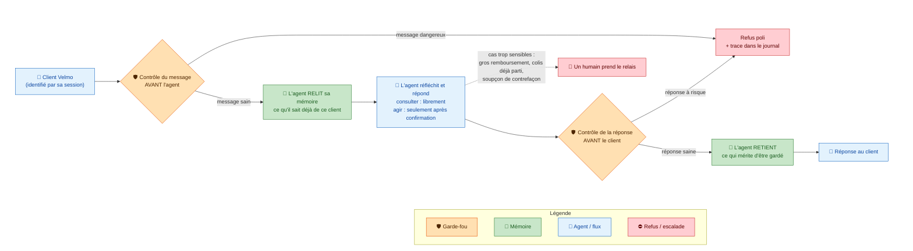

# Architecture globale de Velmo 2.0

## Ce que ce schéma raconte

C'est le trajet d'un message client, de son arrivée jusqu'à la réponse. Chaque message traverse cinq étapes dans un ordre précis, et cet ordre n'est pas un hasard : on vérifie **avant** de réfléchir, et on vérifie **encore** avant de répondre.

## Les points traités dans ce document

- **Le contexte métier** : Velmo vend des maillots de foot collector, souvent une seule pièce par taille. Les clients sont des passionnés qui reviennent — un client qui a déjà donné sa pointure déteste la redonner.
- **Le rôle de l'agent** : traiter seul les demandes simples (suivi, taille, adresse, annulation, retour, remboursement), en gardant le contexte de chaque client dans le temps.
- **La règle d'or de l'agent** : il peut _consulter_ librement (commandes, stock, livraison), mais il n'_agit_ jamais sans confirmation du client, et il passe la main à un humain dès qu'un cas est sensible.
- **Pourquoi tout reconstruire** : l'ancien agent a été rafistolé trop de fois ; un audit externe impose de repartir de zéro sur trois exigences.
- **Les trois exigences de l'audit**, qui deviennent les trois chantiers :
  1. une **mémoire exemplaire** (chantier 1),
  2. des **garde-fous sérieux** (chantier 2),
  3. une **qualité mesurée en continu**, qui prouve qu'aucune version ne régresse (chantier 3).
