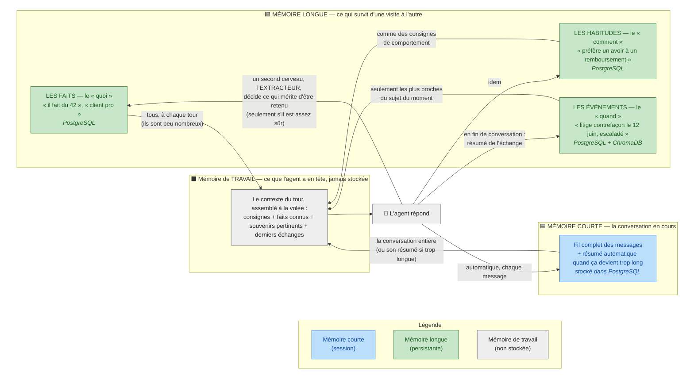

# Comment l'agent se souvient

## Ce que ce schéma raconte

L'agent n'a pas _une_ mémoire mais **trois**, comme un humain : ce qu'il a en tête à l'instant, le fil de la conversation en cours, et ce qu'il retient durablement d'une personne. Le schéma montre comment ces trois mémoires alimentent chaque réponse, et qui a le droit d'y écrire.

## Les points traités dans ce document

- **Tenir une longue conversation sans rien perdre** : même après 30 tours, une information donnée au tout début doit ressortir. Astuce clé : les faits importants sont extraits et rangés à part _avant_ que la conversation ne soit résumée — ils ne sont jamais noyés dans un résumé.
- **Se souvenir d'une visite à l'autre** : la pointure, le statut « client pro », un litige en cours — rechargés automatiquement quand le client revient, même des jours plus tard.
- **Trois natures de souvenirs durables** : les _faits_ (ce qui est vrai sur le client), les _habitudes_ (comment se comporter avec lui), les _événements_ (ce qui s'est passé). Trois natures, trois rangements — parce qu'on ne les utilise pas pareil au moment de répondre.
- **Qui décide de retenir ?** Pas l'agent qui répond : un **second composant dédié**, l'extracteur, analyse l'échange après coup. Il ne retient que ce qui sera encore utile demain, et seulement s'il est suffisamment sûr de lui (un score de confiance avec une barre à franchir — au-dessous, on jette par prudence).
- **Cloisonnement strict** : chaque souvenir est étiqueté avec l'identifiant du client, et toute lecture est filtrée par cet identifiant. La mémoire d'un client n'est jamais visible d'un autre. L'identifiant vient de la session authentifiée, jamais du texte du message (sinon on pourrait se faire passer pour un autre).
- **Droit à l'oubli (RGPD)** : « oublie mon numéro de commande » déclenche une suppression **physique** et réelle — pas un simple marquage — dans les deux bases à la fois, avec une trace prouvant la suppression.
- **Transparence** : on peut à tout moment lister tout ce que l'agent a retenu d'un client, avec l'origine et la date de chaque souvenir (un journal inaltérable note chaque écriture et chaque effacement).
- **Deux outils de stockage, deux rôles** : PostgreSQL est _le classeur_ (la vérité exacte, facile à supprimer proprement) ; ChromaDB est _le moteur de recherche_ (retrouver les événements passés qui ressemblent à la question du moment).
