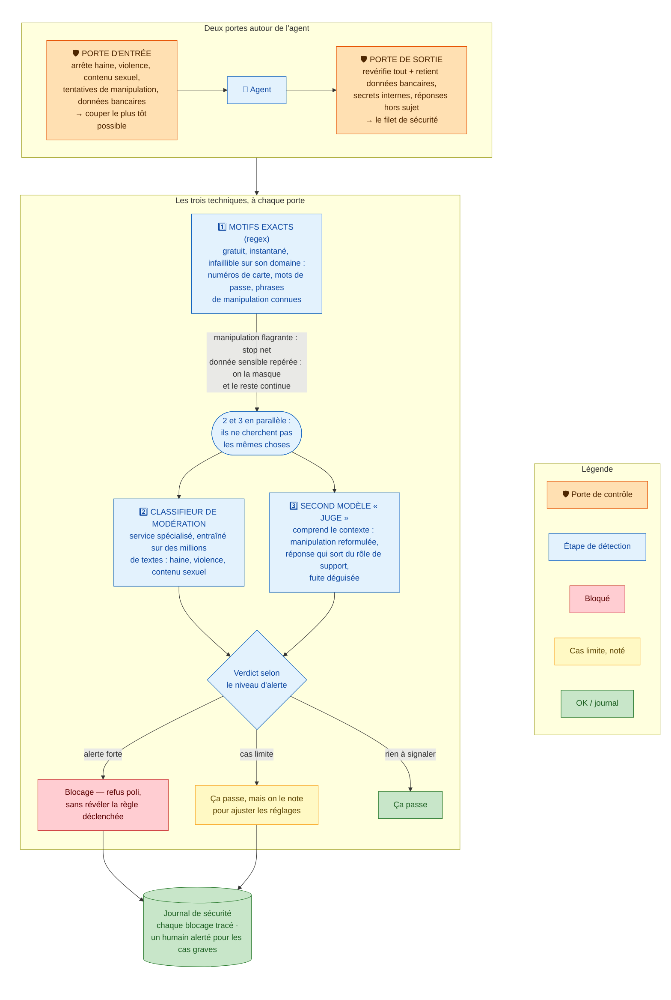

# Les garde-fous

## Ce que ce schéma raconte

Deux portes de sécurité encadrent l'agent : une à l'entrée (le message du client), une à la sortie (la réponse de l'agent). Chaque porte utilise les mêmes trois techniques de détection, de la moins chère à la plus fine.

## Les points traités dans ce document

- **Ce qu'on bloque** (à l'entrée comme à la sortie) : la haine et le harcèlement ; la violence et les menaces ; le contenu sexuel ; les données personnelles sensibles, structurées (numéros de carte, IBAN, mots de passe — bloquées dès l'entrée) ou en texte libre dans les réponses (données d'autres clients) ; les réponses hors du rôle de support (conseil juridique ou médical, promesses engageant Velmo) ; les tentatives de manipulation de l'agent (« ignore tes instructions… ») ; les fuites de secrets techniques internes.
- **Pourquoi deux portes et pas une seule** : si on ne contrôlait qu'à la sortie, l'agent aurait déjà _lu et raisonné_ sur un contenu toxique ou manipulateur — le mal serait fait. La porte d'entrée coupe tôt ; la sortie rattrape ce qui a échappé.
- **Pourquoi trois techniques et pas une** : chaque risque appelle l'outil le moins cher qui suffit. Un numéro de carte se repère à coup sûr par un motif — payer un appel d'IA pour ça serait absurde. Une manipulation reformulée, à l'inverse, échappe à tout motif fixe et exige un jugement contextuel.
- **L'équilibre sécurité / utilité** : un client furieux (« ce maillot est un scandale ! ») n'est pas une menace. Plutôt que de bloquer au moindre doute, les cas limites passent mais sont notés — et ces notes servent ensuite à ajuster les seuils sur des cas réels, pas au jugé.
- **Que se passe-t-il lors d'un blocage** : refus poli et générique (jamais « j'ai détecté votre manipulation » — ce serait donner à l'attaquant de quoi ajuster son attaque), trace dans un journal de sécurité, et alerte humaine pour les cas graves (menace ciblée, attaques répétées).
- **Résister à la manipulation** — l'argument le plus fort du chantier : les garde-fous ne sont **pas des instructions dans le prompt** de l'agent, mais du **code qui s'exécute en dehors** de lui. Un texte injecté peut influencer l'agent ; il ne peut pas désactiver un programme qui tourne avant et après lui. Et le modèle « juge » a son propre contexte isolé : une manipulation qui a piégé l'agent n'a aucune prise sur lui.
- **Deux journaux séparés** : le journal de sécurité est distinct du journal de mémoire, car ils n'ont pas le même régime de conservation — un client peut faire effacer sa mémoire (RGPD), mais les traces d'une tentative d'attaque peuvent être légitimement conservées pour investigation.
