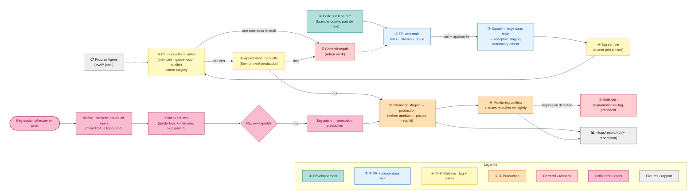

# Prouver qu'on ne régresse jamais

## Ce que ce schéma raconte

À chaque modification de l'agent, une batterie de tests rejoue les mêmes scénarios et produit des notes. Si une seule dimension baisse trop, la livraison est bloquée
automatiquement. `main` est le tronc **toujours livrable** : il alimente en continu
l'environnement de staging ; une **release est un tag** ; la production ne reçoit que des artefacts déjà validés en conditions réelles ; un correctif urgent est une simple branche courte, sans cérémonie de synchronisation.

## Les étapes, en une phrase chacune

1. **Code** sur une branche `feature/*` courte — part de `main`, libre.
2. **PR vers `main`** — palier gratuit : lint, tests unitaires, revue. Pas de suites LLM.
3. **Squash-merge dans `main`** — redéploie automatiquement staging. Les merges se
   sérialisent déjà via Git, pas de file d'attente.
4. **Tag semver** — posé quand l'équipe juge prêt à livrer. C'est le gate de release.
5. **CI de release** : rejoue les 3 batteries contre les fixtures figées, sur staging déjà
   déployé. Une note sous le seuil → bloqué, correctif, retour à l'étape 1.
6. **Approbation manuelle** via l'Environment `production` (required reviewers) — le seul
   geste humain du cycle normal. Refusé → correctif, retour à l'étape 1.
7. **Promotion staging → production** — pas un nouveau déploiement, juste la promotion de
   l'artefact taggé déjà validé.
8. **Monitoring continu** en prod + les 3 suites rejouées chaque nuit.
9. **Rollback** si régression : re-promotion du tag précédent (artefacts immuables).

**Hotfix (urgent)** : en trunk-based, `main` **est** déjà la ligne de production — pas de
flow `develop`/`hotfix` séparé. Un correctif = une branche courte off `main` → suites
réduites (garde-fous + mémoire, la qualité étant bruitée et non bloquante en urgence) → tag
patch → promotion. Zéro double-merge à synchroniser.

## Les points traités dans ce document

- **Trois batteries de tests, une par chantier** : la mémoire (l'info du début ressort-elle
  après 30 tours ? le client revenu est-il reconnu ? l'oubli est-il effectif ?), les
  garde-fous (chaque type d'attaque est-il bloqué ? les messages légitimes passent-ils ?), et
  la qualité générale (pertinence, ton, exactitude — notée par DeepEval).
- **Des scénarios figés, jamais générés à la volée** : seul l'agent change entre deux
  exécutions, tout écart lui est imputable.
- **Qu'est-ce qu'une « version »** : le prompt + les réglages mémoire + les réglages
  garde-fous, identifiés par une **empreinte git** calculée automatiquement. Impossible
  d'oublier de « changer le numéro » : toute modification change l'empreinte.
- **Le verdict se joue dimension par dimension, via un minimum** — jamais sur la moyenne. Si
  les garde-fous chutent de 20 points mais la qualité gagne 10, une moyenne pourrait rester au
  vert alors qu'un garde-fou a disparu. On bloque sur `min(dimensions)` : une seule qui
  flanche suffit.
- **Ne pas bloquer pour du bruit** : mémoire et garde-fous sont vérifiables exactement →
  seuil ferme avec marge + retry tracé. La qualité, jugement d'IA fluctuant, est comparée à la
  version précédente sur une **bande statistique (± 2σ)** plutôt qu'à un seuil absolu.
- **Robustesse du harness** : un échec d'infra (timeout Azure) n'est **pas** compté comme une
  régression de l'agent ; un run incomplet ne produit pas de verdict.
- **Ce qu'on surveille en continu** : note mémoire, taux de blocage, taux de faux positifs,
  latence **et coût** — décomposés par composant, et **pouvant bloquer** (SLO), pas seulement
  reportés.
- **Deux outils, deux responsabilités** : PostgreSQL garde les verdicts et les agrégats qui
  décident (rapide, toujours là) ; Langfuse (Cloud, EU) garde le détail de chaque appel pour
  le drill-down — **hors du chemin de blocage**, aucune donnée de décision dupliquée.
- **`main` comme tronc unique** : plus de branche `develop` ni de verrou de concurrence — les
  PR se sérialisent au merge, staging reflète toujours `main`.
- **Release = tag, promotion = feu vert prod sans nouveau déploiement** : le geste humain a
  lieu une fois, sur staging ; il n'est pas dupliqué après.

## Couverture (complète)

- `memory_cases.jsonl` couvre **R1 à R6** — les cas **R4** (rétention après compression) et
  **R6** (inspection d'un souvenir) ont été ajoutés au chantier 1.
- `guardrail_cases.jsonl` couvre **G1 à G7** via le champ `category` (bijection documentée au
  chantier 2), avec des cas côté **entrée et sortie** (la porte de sortie n'est plus
  sous-testée).
