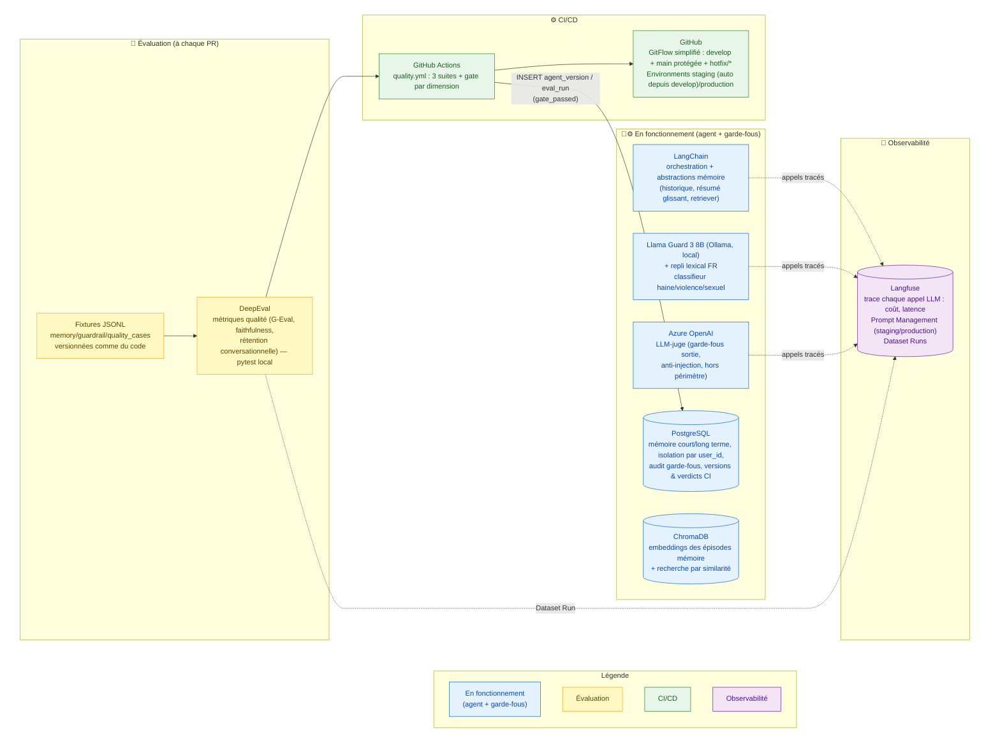

# Les outils de Velmo 2.0

## Ce que ce schéma raconte

Chaque brique de la stack a un rôle précis et ne fait qu'une chose — pas d'outil qui recouvre le travail d'un autre. Ce schéma regroupe tous les outils vus dans les trois chantiers, classés par étape : ce avec quoi l'agent tourne, ce qui le surveille, ce qui le teste, ce qui le déploie.

## Les points traités dans ce document

- **Un outil, une responsabilité** : PostgreSQL décide (verdicts, isolation, pass/fail) ; Langfuse observe (coût, latence, détail de chaque appel) ; ChromaDB retrouve par similarité (embeddings) ; aucun ne duplique le travail d'un autre — le détail de chaque choix est justifié dans le chantier correspondant.
- **Trois natures de détection dans les garde-fous, trois outils différents** : regex/motifs (déterministe, gratuit, pour PII/formats connus), Llama Guard 3 8B via Ollama + repli lexical FR (classifieur local, rapide, pour haine/violence/sexuel explicite), Azure OpenAI en LLM-juge (coûteux mais contextuel, pour l'injection de prompt et le hors-périmètre) — chacun couvre l'angle mort de l'autre (détail : [`conception_chantier2_guardrails.md`](../conceptions/conception_chantier2_guardrails.md)).
- **DeepEval en local, pas de compte externe** : les résultats restent dans `EVAL_RUN` (Postgres) et `mlops/report.md` — pas de dépendance à un service tiers pour un gate qui bloque la livraison.
- **LangChain comme colonne vertébrale mémoire** : `PostgresChatMessageHistory` (court terme), `ConversationSummaryBufferMemory` (résumé glissant R4), retriever `Chroma` (épisodes) — évite de réécrire à la main la gestion de fenêtre de contexte.
- **GitHub à trois niveaux** : le dépôt (branches `develop`/`main`/`hotfix/*`, PR, revue) *et* Actions (exécution CI, paliers différenciés par déclencheur) *et* Environments (`staging` redéployé automatiquement à chaque merge dans `develop` ; `production` en retag automatique au merge `develop → main`, sans rebuild) — trois usages du même outil, pas trois outils.
- **Le LLM principal de l'agent n'est pas figé ici** : le chantier 1 (mémoire) laisse le choix du modèle ouvert délibérément — seul le pipeline d'orchestration (LangChain) et les composants de contrôle (Llama Guard 3, Azure OpenAI en LLM-juge) sont arrêtés dans la conception.
