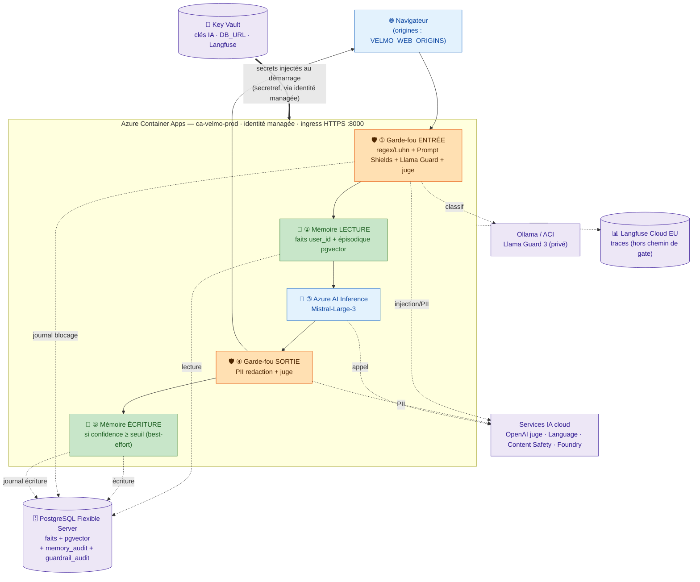

# Schéma de déploiement Azure de Velmo 2.0

## Ce que ce schéma raconte

C'est le schéma d'architecture globale (`00-architecture-globale.md`) **posé sur Azure** :
mêmes cinq étapes, même ordre, mais on voit maintenant **où** tourne l'app, **où** vivent les
secrets, et **où** sont lus/écrits les journaux. La chaîne
**garde-fou entrée → mémoire lecture → LLM → garde-fou sortie → mémoire écriture** est
préservée à l'intérieur de l'hôte.

## Où passent les secrets

- **Key Vault** est la source de vérité unique. L'app (ACA) porte une **identité managée** à
  qui on donne le rôle *Key Vault Secrets User* (tuto §D3).
- Chaque **clé** et la **chaîne de connexion** (`DB_URL`, avec mot de passe) sont déclarées
  comme des **références** Key Vault (`secretref` → `keyvaultref`) et injectées en variables
  d'environnement **au démarrage de la révision** (flèche épaisse). Aucune valeur en clair dans
  la config ACA, l'image, ou Git.
- Les **endpoints** (URL publiques, non secrètes) restent des variables d'app ordinaires.

## Où sont lus/écrits les journaux

- **Décisions des garde-fous** → table `guardrail_audit` (Postgres) : log de sécurité, conservé
  même après une demande d'oubli (intérêt légitime, cf. conception Ch.2).
- **Écritures mémoire** → table `memory_audit` (Postgres) : soumis au droit à l'oubli (R5).
- **Traces d'observabilité** (drill-down par composant) → **Langfuse Cloud EU**, hors du chemin
  de gate ; `eval_run` ne stocke qu'un pointeur (URL de trace), pas la donnée.
- **Logs d'infrastructure** (stdout des conteneurs) → Log Analytics de l'environnement ACA.

## Correspondance avec l'architecture globale

| Étape (schéma 00) | Service Azure |
| --- | --- |
| ① Garde-fou entrée | ACA (regex local) + Ollama/ACI (Llama Guard) + Azure Content Safety + juge Azure OpenAI |
| ② Mémoire lecture | PostgreSQL Flexible Server (+ pgvector) |
| ③ Agent / LLM | Azure AI Inference (Mistral-Large-3) |
| ④ Garde-fou sortie | Azure AI Language (PII) + juge Azure OpenAI |
| ⑤ Mémoire écriture | PostgreSQL Flexible Server |

Le *pourquoi* des choix (ACA vs App Service, Postgres managé pour R2/R3) :
`../conceptions/conception_chantier3_evaluation_mlops.md` §Cible de déploiement.
Le *comment* (commandes `az`) : `../tuto_azure_deploiement.md` §C/§D/§F.
