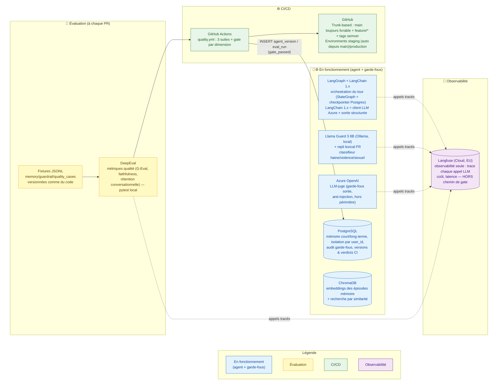

# Les outils de Velmo 2.0

## Ce que ce schéma raconte

Chaque brique de la stack a un rôle précis et ne fait qu'une chose — pas d'outil qui recouvre le travail d'un autre. Ce schéma regroupe tous les outils vus dans les trois chantiers, classés par étape : ce avec quoi l'agent tourne, ce qui le surveille, ce qui le teste, ce qui le déploie.

## Pourquoi chaque outil (et pas un autre)

Chaque brique répond à un besoin précis ; chaque ligne dit **pourquoi cet outil** et
**contre quelle alternative** il a été retenu. Le détail complet est dans la conception du
chantier indiqué.

### Runtime de l'agent

| Outil | Rôle | Pourquoi lui — et pas quoi |
| ----- | ---- | -------------------------- |
| **Mistral-Large-3** (Azure AI Inference) | Modèle de chat principal (répond au client) | Le brief impose « Azure AI Inference, **aucun modèle local** » ; Mistral-Large-3 est un modèle multilingue FR fort déployé sur le tenant. **Alternative écartée** : modèle local (Mistral 7B) — interdit par le brief + qualité conversationnelle insuffisante. _(Écart de modèle exact vs brief : voir dernière puce.)_ |
| **LangGraph** (+ `PostgresSaver`) | Orchestration du tour (`StateGraph`) + persistance de l'état de thread | En **LangChain 1.x les classes `*Memory` sont supprimées** ; LangGraph est la voie native de persistance conversationnelle (reprise après crash gratuite). **Alt écartée** : table `MESSAGE` maison → deux sources de vérité ; `ConversationSummaryBufferMemory` → n'existe plus en 1.x. |
| **LangChain 1.x** (`core`, `azure-ai`) | Client LLM Azure pour l'agent principal | Client déjà en dépendance ; on n'utilise **que** ce qui existe et sert. Extracteur mémoire et juges (garde-fous, DeepEval) appellent leur SDK directement (`openai`/`anthropic`), pas de couche LangChain — parsing JSON fait main côté extracteur. |

### Mémoire (chantier 1)

| Outil | Rôle | Pourquoi lui — et pas quoi |
| ----- | ---- | -------------------------- |
| **PostgreSQL** | Source de vérité relationnelle : faits, règles, threads, audit, versions & verdicts CI | Requêtes **exactes et déterministes**, suppression ciblée (R5), transactions, isolation par `user_id`/RLS (R3), contraintes d'unicité (anti-doublon). Imposé par le brief pour l'état durable. **Alt écartée** : NoSQL/clé-valeur → ni requêtes relationnelles ni `UNIQUE` pour dédoublonner un fait. |
| **PostgreSQL + `pgvector`** | Index vectoriel des épisodes : recherche par similarité (top-k, HNSW) dans la **même base** que faits/threads | Décision **révisée** depuis ChromaDB (initialement imposé) : unifier le store rend R5 **atomique** (oubli en une transaction) et applique la même isolation `user_id`/RLS. La mémoire épisodique **et la KB FAQ** (`velmo.kb_store`, hors mémoire) vivent toutes deux en `pgvector`, même Postgres — plus aucun service Chroma. **Alt écartée** : ChromaDB (épisodes ou FAQ) → store séparé, service réseau et surface de sécurité en plus pour un volume que `pgvector` couvre largement. |
| **`claude-opus-4-5`** (Azure AI Foundry) | Extracteur LLM (faits/règles, JSON court) — partagé avec le juge DeepEval Qualité (Ch.3) | Tâche structurée, pas conversationnelle. Décision **révisée** depuis `gpt-5-mini` réutilisé du juge garde-fous : 3ᵉ modèle assumé, motivé par la fiabilité du juge DeepEval qui gate la release (voir [`conception_chantier1_memoire.md`](../conceptions/conception_chantier1_memoire.md#qui-écrit-quand-quoi-retenir)). **Alt écartée** : réutiliser `gpt-5-mini` (couplage quota/criticité avec le juge garde-fous jugé plus risqué que le coût d'un endpoint de plus). |

### Garde-fous — 3 étages, 3 outils (chantier 2)

| Outil | Rôle | Pourquoi lui — et pas quoi |
| ----- | ---- | -------------------------- |
| **Regex / motifs** (étage 1) | Détection **déterministe** : PII structurée, motifs d'injection connus, secrets | Gratuit, instantané, **zéro faux négatif** sur un format connu (Luhn carte, clé `sk-…`). **Alt écartée** : un LLM pour ça → coûteux et faillible sur une tâche exacte. |
| **Llama Guard 3 8B** (Ollama, local) (étage 2) | Classifieur modération G1/G2/G3 (haine/violence/sexuel) | Multilingue **FR**, local (aucune clé/coût), taxonomie MLCommons native. **Alt écartée** : **Detoxify** (anglais Jigsaw) → score ~0 sur cas FR clairs (**mesuré** : auto-agression 0.008) ; volet modération de Content Safety → doublon payant. |
| **Azure OpenAI `gpt-5-mini`** (étage 3, LLM-juge garde-fous) | Jugement contextuel (G5/G6/G7 subtils) | Qualité de **jugement contextuel** (injection reformulée, fuite subtile) où un petit modèle local rate ; accès Azure inclus formation ; chemin bloquant synchrone → modèle rapide/économique suffisant. **Alt écartée** : Mistral 7B local → faux nég/pos. |
| **Prompt Shields** (Content Safety) — _feature-flag_ | Détection spécialisée injection/jailbreak (G6), en complément du juge | Moins cher qu'un appel LLM complet sur une détection ciblée. **Non baseline** : dépendance cloud de plus → activé seulement si son **gain incrémental est mesuré** (Ch.3). |
| **PII redaction** (Azure AI Language) — _feature-flag_ | PII en **texte libre** en sortie (G4) au-delà des formats regex | Couvre nom/adresse d'un autre client que la regex rate. **Non baseline** : **faux positifs** sur noms de joueurs/clubs + coût → activé sous mesure. |

### Évaluation & MLOps (chantier 3)

| Outil | Rôle | Pourquoi lui — et pas quoi |
| ----- | ---- | -------------------------- |
| **Fixtures JSONL** (`*_cases.jsonl`) | Jeux de cas **figés et versionnés** (mémoire/garde-fous/qualité) | Reproductibilité : seul l'agent change entre deux runs → tout delta de note lui est imputable. **Alt écartée** : cas générés à la volée → note non imputable (agent ou tirage ?). |
| **DeepEval** (local, pytest) | Métriques qualité (G-Eval, faithfulness, answer relevancy) | Métriques **déjà calibrées**, exécutées en local, **aucun compte externe**. **Alt écartée** : juge maison → réinventer des métriques calibrées ; et R1 reste hors de son gate (métrique flaky ≠ exigence non négociable). |

### CI/CD & observabilité (chantier 3)

| Outil | Rôle | Pourquoi lui — et pas quoi |
| ----- | ---- | -------------------------- |
| **GitHub Actions** | Exécute les 3 suites + applique le gate `min(dimensions)` | CI GitHub imposée par le brief, intégrée au repo. **Alt écartée** : autre CI → hors brief. |
| **GitHub trunk-based + Environments** | `main` toujours livrable + `feature/*` + **tags** = releases ; Environments = cibles de déploiement | Sobre, aligné continuous delivery ; approbation manuelle portée par l'Environment `production`. **Alt écartée** : **GitFlow** → `develop` + double-merge hotfix = poids mort sans trains de release parallèles. |
| **Langfuse (Cloud, EU)** | Observabilité : trace chaque appel LLM (coût, latence) — **hors chemin de gate** | Projet pédagogique, pas de vraie PII client en prod → Cloud EU pour un setup rapide (self-host resterait la bonne pratique en vraie prod, RGPD) ; **découplé** du gate (Langfuse down ≠ CI cassée) ; versioning = hash git, pas Prompt Management. **Alt écartée** : **LangSmith** → SaaS sans région EU explicite ni option self-host ; mettre les métriques-gate dans Langfuse → couplage à un tiers ; recalcul manuel → désync du code. |

---

## Les points traités dans ce document

- **Un outil, une responsabilité** : PostgreSQL décide (verdicts, isolation, pass/fail) ; Langfuse observe (coût, latence, détail de chaque appel) ; ChromaDB retrouve par similarité (embeddings) ; aucun ne duplique le travail d'un autre — le détail de chaque choix est justifié dans le chantier correspondant.
- **Trois natures de détection dans les garde-fous, trois outils différents** : regex/motifs (déterministe, gratuit, pour PII/formats connus), Llama Guard 3 8B via Ollama + repli lexical FR (classifieur local, rapide, pour haine/violence/sexuel explicite), Azure OpenAI en LLM-juge (coûteux mais contextuel, pour l'injection de prompt et le hors-périmètre) — chacun couvre l'angle mort de l'autre (détail : [`conception_chantier2_guardrails.md`](../conceptions/conception_chantier2_guardrails.md)).
- **DeepEval en local, pas de compte externe** : les résultats restent dans `EVAL_RUN` (Postgres) et `mlops/report.md` — pas de dépendance à un service tiers pour un gate qui bloque la livraison.
- **LangGraph comme colonne vertébrale mémoire** : le `checkpointer PostgresSaver` persiste l'état de thread (fil + résumé glissant R4) ; les classes `*Memory` de LangChain 0.x sont **supprimées en 1.x**, LangChain 1.x se limite au client LLM Azure + sortie structurée ; ChromaDB est accédé en client natif (détail : [`conception_chantier1_memoire.md`](../conceptions/conception_chantier1_memoire.md)).
- **GitHub à trois niveaux** : le dépôt (tronc `main` toujours livrable + `feature/*` courtes + **tags semver**, PR, revue) *et* Actions (exécution CI, paliers différenciés par déclencheur) *et* Environments (`staging` redéployé à chaque merge dans `main` ; `production` par **promotion du tag validé**, sans rebuild) — trois usages du même outil, pas trois outils.
- **LLM principal de l'agent — écart assumé au brief** : `reco_expert.md` **impose** Azure AI Inference / **Kimi-K2.6** ; le déploiement réel utilise **Mistral-Large-3** (même fournisseur Azure AI Inference, variable `AZURE_AI_INFERENCE_MODEL`, cf. `llm.py`). Déviation **tracée et assumée** : la contrainte structurante du brief (« Azure AI Inference, **aucun modèle local** ») reste **respectée** — seul le modèle exact change (choix effectif de déploiement sur le tenant Azure). Le pipeline d'orchestration (LangGraph) et les composants de contrôle (Llama Guard 3, LLM-juge `gpt-5-mini`) sont indépendants de ce choix.

┌─────────────────────────────────────────────────────┬────────────────────────┬──────────────────────────────────────────────────────────────────────────────┐
│                        Model                        │        Hosting         │                                   Used by                                    │
├─────────────────────────────────────────────────────┼────────────────────────┼──────────────────────────────────────────────────────────────────────────────┤
│ Mistral-Large-3 (azure_ai_inference)                │ Azure, cloud           │ quality suite (agent response) + memory suite (summary)                      │
│                                                     │ deployment             │                                                                              │
├─────────────────────────────────────────────────────┼────────────────────────┼──────────────────────────────────────────────────────────────────────────────┤
│ claude-opus-4-5 (anthropic_async, via Azure         │ Azure, cloud           │ quality suite (judge) + memory suite (extractor)                             │
│ Foundry)                                            │ deployment             │                                                                              │
├─────────────────────────────────────────────────────┼────────────────────────┼──────────────────────────────────────────────────────────────────────────────┤
│ gpt-5-mini (azure_openai_guard)                     │ Azure, cloud           │ guardrails suite (judge) only                                                │
│                                                     │ deployment             │                                                                              │
├─────────────────────────────────────────────────────┼────────────────────────┼──────────────────────────────────────────────────────────────────────────────┤
│ llama-guard3:8b                                     │ local Ollamclassifier) — not a drift candidate, you control that tag        │
│                                                     │                        │ directly                                                                     │